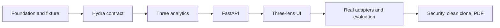

# X-Ray Evidence Platform — 3-Day Implementation Plan

> **For agentic workers:** REQUIRED SUB-SKILL: Use superpowers:subagent-driven-development (recommended) or superpowers:executing-plans to implement this plan task-by-task. Steps use checkbox (`- [ ]`) syntax for tracking.

**Goal:** Build a reproducible, evidence-first socio-technical X-Ray that runs on self-hosted HydraDB, detects Ghosts, Faultlines, and explicit corpus Gaps, and exposes every result with its bounded Cypher, provenance, confidence, and limitations.

**Architecture:** Immutable normalized evidence lives in Parquet and is queried through DuckDB; HydraDB stores safe graph topology and executes bounded traversal; Python services derive findings and expose a versioned FastAPI contract; React and Cytoscape.js render a deterministic, accessible three-lens interface. A labelled synthetic fixture proves the complete product, while real adapters publish a capability report and never fabricate relationships missing from their source.

**Tech Stack:** Python 3.13, uv, Pydantic 2, FastAPI, Polars, DuckDB/Parquet, Neo4j Python driver, NetworkX, pytest, Hypothesis, Ruff, MyPy, React 19, TypeScript, Vite, TanStack Query 5, `openapi-fetch`, Cytoscape.js, CSS custom-property themes, Vitest, Testing Library, MSW, Playwright, Docker Compose, MinIO, HydraDB v0.1.1, pypdf, Mermaid CLI, Pandoc/Typst, and Poppler.

**Delivery constraint:** Produce the submission-complete vertical slice in three working days using an eight-agent peak pool organized into four ownership lanes, with one human/integration owner. Optional licensed-corpus ingestion, provider-backed retrieval evaluation, and throughput trials remain a post-sprint full-platform delta.

## Global Constraints

- The corrected design at `docs/superpowers/specs/2026-08-14-xray-evidence-platform-design.md` is authoritative when it conflicts with `xray-build-spec.md`.
- Pin HydraDB to tag `v0.1.1`, commit `02a40025d2d57e97ab2754c8256219cdbfeab379`, and image `ghcr.io/hydra-db/hydradb@sha256:db78309a233be54662db29744047e985a39b51c45a270d1a1f47c31a62cdb709`.
- Use only the self-hosted open-source engine. Do not call `api.hydradb.com` or hosted Hydra SDKs.
- Run HydraDB with `RUST_MIN_STACK=33554432`; readiness requires `/readyz` plus a successful write/read/path round trip.
- Ordinary Cypher matches use positive 63-bit integer `id` values (`1..2^63-1`; zero is reserved); every traversable node also has a unique string `path_key` resolved through HydraDB's canonical vertex-property index.
- At the pinned release, `MSpaths.sourceValues` and `targetValues` are validated inline string literals. They are not list parameters.
- All Ghost/Faultline `MSpaths` queries hard-code `relTypes: ['COMMUNICATES']`; artifact, ownership, authorship, and dependency edges can never satisfy a human-coordination path.
- `pairwise: true` is an unordered cross-set traversal, not positional pairing. Identify returned pairs from path endpoints and filter client-side.
- Native procedure rows are consumed client-side. Do not use `RETURN collect(path)`.
- Every path has an explicit maximum: people paths at most four hops; custody paths at most eight hops.
- One statement is sent per auto-commit request. Batched nodes use `UNWIND $rows AS row MERGE ... SET`; relationships load only after their endpoint nodes.
- Hydra properties are only `int`, `float`, `bool`, or `string`; raw message bodies and credentials never enter HydraDB.
- A timeout, truncation, unresolved identity, absent capability, or incomplete result is `indeterminate` or `unsupported`, never a negative finding.
- UI copy must not claim “never communicated” or that a record was deleted. Canonical Gap copy is: “Absence does not establish deletion. The corpus is structurally incomplete at this point.”
- HERB is downloaded only after explicit CC BY-NC 4.0 acknowledgement and is never redistributed. Its released fields support mention/co-participation, not reply, code-dependency, or deletion claims.
- EnterpriseRAG-Bench integration is opt-in and slice-based; the full corpus is never a default dependency.
- The approved UI direction is the user-supplied 806×589 terminal-theme reference from 2026-08-14: deep Nightfox shell, teal active selection, muted blue-grey type, large rounded surfaces, restrained desktop-window chrome, and keyboard-first searchable theme dialog. Do not substitute a generic card dashboard.
- Application code is Apache-2.0. HydraDB remains a separately deployed AGPL-3.0 service and is identified in third-party notices.
- No non-synthetic source may be processed until the minimum policy, pseudonymization, redaction, writable audit sink, localhost binding, and session-authentication gate in task 10 passes. Task 21 hardens and operationalizes those controls.
- A finding response contains only an `EvidenceSummary`; full provenance is returned solely by the `evidence:read`-protected evidence endpoint.
- Every top-level lens payload carries `analysis_status` and `status_explanation`. `partial` and `unsupported` are never rendered as an empty successful result.
- Work test-first. Each task is accepted only after its focused tests, relevant full suite, formatting, and type checks pass.
- Preserve unrelated files in the enclosing home-directory worktree. Stage only paths belonging to this project.

## Delivery order and checkpoints



| Checkpoint | Required tasks | Observable result |
|---|---:|---|
| C1 — deterministic evidence | 1–3 | Fixture emits stable Parquet and ground truth |
| C2 — graph-native core | 4–6 | Pinned HydraDB loads twice idempotently and returns real bounded paths |
| C3 — backend vertical slice | 7–10 | All three analyses and evidence API work on the fixture |
| C4 — product vertical slice | 11–17 | Complete three-panel browser journey works against HydraDB |
| C5 — real-source credibility | 18 and deterministic part of 20 | Slack/Git report only supported findings; fixture detection metrics are measured |
| C6 — submission build | 21–23 | Hardened privacy controls, CI, clean clone, docs, verified PDF, and Acrobat handoff |
| C7 — full platform | 19–20 | Opt-in licensed datasets, provider-backed retrieval evaluation, and isolated throughput study are complete |

**Submission complete** means tasks 1–18, the deterministic detection portion of task 20, and tasks 21–23 pass with synthetic data, a clean-clone report, and a verified PDF. **Full platform complete** additionally requires task 19, provider-backed retrieval evaluation, and the isolated throughput study in task 20. Optional steps are labelled in their task and may not be reported as complete when deferred.

## Execution prerequisites

- Git, Python 3.13, Node.js 22+, npm 10+, and Docker Desktop with the Linux engine running.
- Install uv before task 1 with `python -m pip install --user uv`; verify with `uv --version`.
- Adobe Acrobat is required only for the final GUI handoff; PDF generation and verification remain open-source and headless.
- Task 4 resolves and records immutable digests for every runtime service image. Task 23 uses document-tool images recorded separately in `infra/docs-images.lock`; neither CI nor the PDF build may pull a floating tag.
- Keep runtime images in `infra/runtime-images.lock` and documentation/QA images in `infra/docs-images.lock`. Evaluation hashes only the runtime lock plus effective runtime digests; task 23 may modify only the docs lock, so the measured runtime never changes under the final release tree.
- Network access is required only to install locked dependencies, pull pinned container images, and explicitly download optional datasets. Request approval at the point of use.
- Before implementation, use `superpowers:using-git-worktrees` if isolation from the enclosing worktree is required. The executor must validate `git rev-parse --show-toplevel`, `--git-dir`, and `--git-common-dir` first.

## Pinned primary references

- HydraDB v0.1.1 source: `https://github.com/hydra-db/hydradb/tree/02a40025d2d57e97ab2754c8256219cdbfeab379`
- HydraDB Cypher subset: `https://github.com/hydra-db/hydradb/blob/02a40025d2d57e97ab2754c8256219cdbfeab379/cypher-compat.md`
- HydraDB package: `https://github.com/hydra-db/hydradb/pkgs/container/hydradb`
- HERB source and evaluator: `https://github.com/SalesforceAIResearch/HERB`
- HERB dataset card and license: `https://huggingface.co/datasets/Salesforce/HERB`
- EnterpriseRAG-Bench v1 source: `https://github.com/onyx-dot-app/EnterpriseRAG-Bench/tree/v1.0.0`

## Source audit that fixes the implementation boundary

The pre-implementation raw-file audit is a constraint, not a benchmark result; task 19 must reproduce it into a signed capability manifest before using the corpus:

| Source | Observed released shape | What X-Ray may claim |
|---|---|---|
| HERB | 30 product JSON files, 38,600 artifacts, 530 team employees; all 33,632 Slack `ThreadReplies` arrays are empty; 9,405 messages contain explicit employee mentions across 3,296 unique directed mention pairs | Mention/co-participation communication graph and retrieval only; no reply graph |
| HERB pull requests | Title/summary/link/state/user/reviews metadata, but no changed files, diffs, commits, modules, or dependency facts; `EMP_*` PR/reviewer identities have no released mapping to Slack `eid_*` identities | No observed ownership or technical-dependency edge without an explicit external mapping/source |
| HERB/EnterpriseRAG released events | No complete ticket-state history or deletion/audit ledger; EnterpriseRAG's large flattened corpus likewise does not supply an authoritative code topology | No factual Gap/deletion or Faultline claim; report unsupported and use the labelled fixture for the complete product proof |

HERB's viewer/schema casting failure is why the optional adapter reads pinned raw JSON rather than `load_dataset()`. These counts are verified again from hashes at ingestion; a changed revision yields a new capability report, never an assumed one.

## Repository map

```text
hydra/
  pyproject.toml
  uv.lock
  package.json
  package-lock.json
  compose.yaml
  compose.test.yaml
  .env.example
  LICENSE
  THIRD_PARTY_NOTICES.md
  SECURITY.md
  apps/
    api/
      pyproject.toml
      src/xray_api/{app,dependencies,errors,routes,schemas}.py
      tests/{test_health,test_routes,test_errors}.py
    web/
      package.json
      vite.config.ts
      vitest.config.ts
      playwright.config.ts
      src/{api,app,components,content,features,graph,hooks,styles,test}/
      e2e/
  packages/
    xray_core/src/xray_core/{models,ports,scoring}.py
    xray_ingest/src/xray_ingest/{canonicalize,derive,gaps,ids,manifest,pipeline,sources}.py
    xray_hydra/src/xray_hydra/{cypher,gateway,loader}.py
    xray_analytics/src/xray_analytics/{faultline,gap,ghost,layout,path_rows}.py
    xray_runtime/src/xray_runtime/{manager,models}.py
  data/
    fixtures/xray-demo/{directory,events,git_facts,ground_truth,manifest}.json
    schemas/{canonical-record,evidence-record,ground-truth}.schema.json
    .gitignore
  infra/
    images.lock
    hydradb/
    minio/
  scripts/
    setup.sh
    setup.ps1
    wait_healthy.py
    download_herb.py
    benchmark_ingest.py
    build_blueprint.py
    open_acrobat.ps1
  tests/
    contract/
    integration/
    acceptance/
    evaluation/
    infra/
    privacy/
  config/{scoring,data-policy.example}.yaml
  reports/.gitignore
  docs/{architecture,data-sources,evaluation,operations,privacy-and-threat-model,claims-ledger}.md
  docs/blueprint/X-Ray-Implementation-Blueprint.md
  docs/blueprint/{architecture,timeline}.mmd
  .github/workflows/{ci,integration}.yml
```

## Stable cross-workstream contracts

Create these internal types in `packages/xray_core/src/xray_core/models.py`; later tasks extend them without renaming fields:

```python
from collections.abc import Collection, Iterable, Mapping, Sequence
from enum import StrEnum
from typing import Literal, Protocol, TypeAlias
from pydantic import BaseModel, Field, field_validator, model_validator

Scalar: TypeAlias = int | float | bool | str

class EvidenceClass(StrEnum):
    OBSERVED = "observed"
    INFERRED = "inferred"
    DEMO_GROUND_TRUTH = "demo_ground_truth"

class AnalysisStatus(StrEnum):
    COMPLETE = "complete"
    PARTIAL = "partial"
    UNSUPPORTED = "unsupported"

class ReachabilityStatus(StrEnum):
    REACHABLE = "reachable"
    NOT_REACHABLE_WITHIN_BOUND = "not_reachable_within_bound"
    INDETERMINATE = "indeterminate"

class ExecutionStatus(StrEnum):
    COMPLETE = "complete"
    PARTIAL = "partial"
    FAILED = "failed"

class CanonicalRecord(BaseModel):
    source: str
    external_id: str
    kind: str
    occurred_at_epoch: int = Field(ge=0)
    author_external_id: str | None
    parent_external_id: str | None
    subjects: tuple[str, ...]
    content_sha256: str
    content: str | None
    metadata: dict[str, Scalar]

class SequenceStep(BaseModel):
    ordinal: int = Field(ge=0)
    canonical_key: str
    artifact_kind: str
    required: bool = True
    earliest_epoch: int | None = Field(default=None, ge=0)
    latest_epoch: int | None = Field(default=None, ge=0)

class SequenceContract(BaseModel):
    contract_id: str
    contract_kind: Literal["contiguous_sequence", "required_audit_transition"]
    sequence_key: str
    steps: tuple[SequenceStep, ...] = Field(min_length=2)
    source_uri: str
    content_sha256: str = Field(pattern=r"^[0-9a-f]{64}$")
    limitations: tuple[str, ...] = ()

class SequenceContractSet(BaseModel):
    contracts: tuple[SequenceContract, ...] = ()
    limitations: tuple[str, ...] = ()

class EvidenceRecord(BaseModel):
    evidence_id: str
    run_id: str
    source_type: str
    source_uri: str
    source_record_id: str
    observed_epoch: int = Field(ge=0)
    subject_key: str
    predicate: str
    object_key: str
    evidence_class: EvidenceClass
    confidence: int = Field(ge=0, le=100)
    extraction_method: str
    content_sha256: str
    redacted_excerpt: str
    metadata_json: str

class NodeRow(BaseModel):
    id: int = Field(gt=0, le=2**63 - 1)
    canonical_key: str
    path_key: str
    label: Literal["Person", "Team", "Artifact", "Module", "Phantom"]
    evidence_class: EvidenceClass
    confidence: int = Field(ge=0, le=100)
    properties: dict[str, Scalar]
    evidence_ids: tuple[str, ...]

class EdgeRow(BaseModel):
    id: int = Field(gt=0, le=2**63 - 1)
    canonical_key: str
    source_id: int = Field(gt=0, le=2**63 - 1)
    target_id: int = Field(gt=0, le=2**63 - 1)
    rel_type: Literal[
        "REPORTS_TO", "AUTHORED", "MENTIONS", "COMMUNICATES",
        "ABOUT", "OWNS", "DEPENDS_ON", "PRECEDED_BY"
    ]
    evidence_class: EvidenceClass
    confidence: int = Field(ge=0, le=100)
    properties: dict[str, Scalar]
    evidence_ids: tuple[str, ...]

class CanonicalBundle(BaseModel):
    dataset_id: str
    nodes: tuple[NodeRow, ...]
    edges: tuple[EdgeRow, ...]
    evidence: tuple[EvidenceRecord, ...]
    limitations: tuple[str, ...] = ()

class SnapshotManifest(BaseModel):
    snapshot_id: str
    dataset_id: str
    schema_version: str
    content_sha256: str
    row_counts: dict[str, int]
    file_sha256: dict[str, str]

class NormalizedPosition(BaseModel):
    x: float = Field(ge=0, le=1)
    y: float = Field(ge=0, le=1)

class QuerySpec(BaseModel):
    name: str
    statement: str
    parameters: dict[str, Scalar]
    max_len: int | None
    result_limit: int | None

class WriteBatchSpec(BaseModel):
    name: str
    statement: str
    rows: tuple[dict[str, Scalar], ...]

class GapDerivation(BaseModel):
    phantoms: tuple[NodeRow, ...]
    edges: tuple[EdgeRow, ...]
    evidence: tuple[EvidenceRecord, ...]
    limitations: tuple[str, ...]

class LoadReport(BaseModel):
    snapshot_id: str
    node_count: int = Field(ge=0)
    edge_count: int = Field(ge=0)
    attempted_batches: int = Field(ge=0)
    completed_batches: int = Field(ge=0)
    resumed_batches: int = Field(ge=0)
    failed_batches: tuple[str, ...]
    graph_fingerprint: str
    verification_queries: tuple[QuerySpec, ...]

class FaultlineScoreInputs(BaseModel):
    dependency_weight_percentile: float = Field(ge=0, le=1)
    coordination_risk: float = Field(ge=0, le=1)
    min_owner_confidence: float = Field(ge=0, le=1)
    module_criticality: float = Field(ge=0, le=1)
    evidence_weight: float = Field(ge=0, le=1)

class RetentionPlan(BaseModel):
    tenant_id: str
    source_snapshot_id: str
    green_graph_id: str
    green_object_prefix: str
    retained_evidence_sha256: tuple[str, ...]
    deleted_evidence_sha256: tuple[str, ...]
    legal_hold: bool
    confirmation_sha256: str

class RetentionResult(BaseModel):
    active_snapshot_id: str
    pointer_swapped: bool
    local_purge_complete: bool
    residual_graph_objects: bool
    rollback_performed: bool
    verification_sha256: str
```

The graph port in `packages/xray_core/src/xray_core/ports.py` is:

```python
class PathRecord(BaseModel):
    source_path_key: str
    target_path_key: str
    node_ids: tuple[int, ...]
    node_path_keys: tuple[str, ...]
    path_cost: float
    path_weight: float

class EndpointExpectation(BaseModel):
    path_key: str
    hydra_id: int = Field(gt=0, le=2**63 - 1)
    canonical_key: str
    dataset_id: str

class EndpointResolution(BaseModel):
    expectation: EndpointExpectation
    status: Literal["resolved", "missing", "identity_mismatch"]
    observed_hydra_id: int | None = None
    observed_canonical_key: str | None = None

class PairEvaluation(BaseModel):
    source_path_key: str
    target_path_key: str
    source_resolution: EndpointResolution
    target_resolution: EndpointResolution
    status: ExecutionStatus
    returned_rows: int = Field(ge=0)
    query_names: tuple[str, ...]

class PathBatchResult(BaseModel):
    query: str
    requested_pairs: frozenset[tuple[str, str]]
    paths: tuple[PathRecord, ...]
    pair_evaluations: tuple[PairEvaluation, ...]
    complete: bool
    truncated: bool
    duration_ms: float
    error: str | None = None

class GraphGateway(Protocol):
    def run(self, query: QuerySpec) -> list[dict[str, object]]: ...
    def run_batch(self, batch: WriteBatchSpec) -> list[dict[str, object]]: ...
    def paths(
        self,
        query: QuerySpec,
        requested_pairs: set[tuple[str, str]],
        expected_endpoints: Mapping[str, EndpointExpectation],
    ) -> PathBatchResult: ...

class EvidenceRepository(Protocol):
    def nodes(self, label: str | None = None) -> tuple[NodeRow, ...]: ...
    def edges(self, rel_type: str | None = None) -> tuple[EdgeRow, ...]: ...
    def evidence(self, ids: Collection[str]) -> tuple[EvidenceRecord, ...]: ...
    def adjacency(self, rel_type: str) -> dict[int, frozenset[int]]: ...
    def limitations(self) -> tuple[str, ...]: ...

class SnapshotRegistry(Protocol):
    def current(self, tenant_id: str) -> SnapshotRef: ...
    def get(self, tenant_id: str, snapshot_id: str) -> SnapshotRef | None: ...
    def compare_and_swap(
        self,
        tenant_id: str,
        expected_snapshot_id: str,
        replacement: SnapshotRef,
    ) -> bool: ...
```

`SnapshotRef` contains tenant ID, snapshot ID, evidence directory, graph namespace/ID, object prefix, manifest hash, and activation timestamp. API models use snake_case. Confidence is stored internally as integer 0–100 and exposed as float 0–1. The frontend treats `not_reachable_within_bound` and `indeterminate` as different states.

---

### Task 1: Bootstrap the monorepo and labelled acceptance fixture

**Files:**
- Create: `pyproject.toml`, `apps/api/pyproject.toml`, each `packages/*/pyproject.toml`
- Create: `package.json`, `apps/web/package.json`
- Create: `data/fixtures/xray-demo/*.json`, `data/schemas/*.schema.json`
- Create: `tests/contract/test_demo_fixture.py`
- Create: `.gitignore`, `data/.gitignore`, `reports/.gitignore`

**Interfaces:**
- Produces dataset ID `xray-demo-v1` and ground truth keys used by every acceptance test.
- Produces `uv run pytest`, `uv run ruff`, `uv run mypy`, and `npm --workspace apps/web` command surfaces.

- [ ] **Step 1: Write the failing fixture contract test**

```python
def test_demo_fixture_declares_three_evidence_backed_findings(demo_fixture: dict) -> None:
    assert demo_fixture["dataset_id"] == "xray-demo-v1"
    assert demo_fixture["ground_truth"] == {
        "ghost_person_key": "person:maya-chen",
        "faultline_module_keys": ["module:payments-api", "module:ledger-worker"],
        "gap_path": {
            "source_artifact_key": "artifact:code-change",
            "target_artifact_key": "artifact:directive",
            "phantom_key": "artifact:missing-approval",
        },
    }
    assert set(demo_fixture["evidence_classes"]) == {
        "observed", "inferred", "demo_ground_truth"
    }
```

- [ ] **Step 2: Run the test and confirm the fixture is absent**

Run: `uv run pytest tests/contract/test_demo_fixture.py -q`
Expected: FAIL because the workspace and fixture files do not exist.

- [ ] **Step 3: Create the deterministic fixture**

Encode this topology in the checked-in source records:

```python
PEOPLE = [
    "maya-chen", "alex-rivera", "priya-shah", "omar-haddad", "lena-park",
    "theo-brooks", "nina-okafor", "sam-wu", "ines-costa", "jon-bell",
]
COMMUNICATIONS = [
    ("alex-rivera", "priya-shah", 3),
    ("alex-rivera", "maya-chen", 5),
    ("priya-shah", "maya-chen", 4),
    ("maya-chen", "omar-haddad", 5),
    ("maya-chen", "lena-park", 4),
    ("omar-haddad", "lena-park", 3),
    ("nina-okafor", "sam-wu", 20),
    ("nina-okafor", "ines-costa", 20),
    ("nina-okafor", "jon-bell", 20),
    ("sam-wu", "ines-costa", 1),
    ("sam-wu", "jon-bell", 1),
    ("ines-costa", "jon-bell", 1),
]
DEPENDENCIES = [
    ("payments-api", "ledger-worker", "import", 12),
    ("identity-api", "audit-sink", "cochange", 3),
]
OWNERS = {
    "payments-api": "alex-rivera",
    "ledger-worker": "theo-brooks",
    "identity-api": "omar-haddad",
}
LINEAGE = [
    ("artifact:code-change", "artifact:missing-approval"),
    ("artifact:missing-approval", "artifact:directive"),
]
```

Nina's dense local cluster gives her higher weighted degree than Maya without cross-community brokerage. Set Maya’s `role_rank` to 1, place Theo outside the communication component, label `artifact:missing-approval` as a sequence-contract Phantom, and store ground truth separately from the input records. The Ghost ground truth asserts Maya is top sampled broker while Nina is top weighted-degree baseline, demonstrating that the lens is not merely degree ranking. Hydra’s deterministic 63-bit IDs remain server-side; browser contracts use canonical string keys so JavaScript never loses integer precision.

- [ ] **Step 4: Add locked workspace tooling and rerun validation**

Use a uv workspace for Python and an npm workspace for `apps/web`. Configure Ruff for Python 3.13 and 100-character lines; configure strict MyPy and pytest markers `integration`, `acceptance`, and `external_data`.

The root project must install every workspace package so root-level test commands resolve imports:

```toml
[tool.uv.workspace]
members = ["apps/api", "packages/*"]

[tool.uv.sources]
xray-core = { workspace = true }
xray-ingest = { workspace = true }
xray-hydra = { workspace = true }
xray-analytics = { workspace = true }
xray-runtime = { workspace = true }
xray-api = { workspace = true }
```

Declare those six packages in the root project dependencies and give each member the matching `[project].name`.

Install and lock these dependency groups:

```powershell
uv add --package xray-core pydantic pyyaml
uv add --package xray-ingest polars duckdb pyarrow jsonschema
uv add --package xray-hydra neo4j
uv add --package xray-analytics networkx scipy
uv add --package xray-runtime pydantic
uv add --package xray-api fastapi "uvicorn[standard]" cryptography huggingface-hub
uv add --dev pytest hypothesis pytest-cov httpx ruff mypy pip-audit pypdf
npm install --workspace apps/web react@19 react-dom@19 @tanstack/react-query@5 openapi-fetch cytoscape @fontsource-variable/inter @fontsource-variable/jetbrains-mono
npm install --workspace apps/web --save-dev typescript vite @vitejs/plugin-react vitest jsdom @testing-library/react @testing-library/user-event @testing-library/jest-dom msw @playwright/test @axe-core/playwright openapi-typescript eslint
```

Run:

```powershell
uv lock
npm install
uv run pytest tests/contract/test_demo_fixture.py -q
uv run ruff check .
```

Expected: PASS and lockfiles created.

- [ ] **Step 5: Commit the foundation**

```powershell
git add pyproject.toml uv.lock package.json package-lock.json apps packages data tests/contract .gitignore reports/.gitignore
git commit -m "chore: bootstrap X-Ray evidence workspace"
```

---

### Task 2: Implement canonical graph models and deterministic IDs

**Files:**
- Create: `packages/xray_core/src/xray_core/models.py`
- Create: `packages/xray_ingest/src/xray_ingest/ids.py`
- Create: `packages/xray_ingest/src/xray_ingest/canonicalize.py`
- Test: `tests/contract/test_models.py`, `tests/contract/test_ids.py`

**Interfaces:**
- Produces the stable model contracts above.
- Produces `stable_id(dataset_id: str, label: str, canonical_key: str) -> int`.
- Produces `path_key(label: str, node_id: int) -> str`.
- Produces `canonicalize(records: Iterable[CanonicalRecord], dataset_id: str) -> CanonicalBundle`.

- [ ] **Step 1: Write failing strictness and determinism tests**

```python
def test_node_rejects_nonprimitive_hydra_property() -> None:
    with pytest.raises(ValidationError):
        NodeRow(
            id=1,
            canonical_key="person:test",
            path_key="person:00000000000000000001",
            label="Person",
            evidence_class="observed",
            confidence=100,
            properties={"teams": [1, 2]},
            evidence_ids=(),
        )

def test_canonicalization_is_order_independent(source_records) -> None:
    first = canonicalize(source_records, "xray-demo-v1").model_dump_json()
    second = canonicalize(reversed(source_records), "xray-demo-v1").model_dump_json()
    assert first == second
```

- [ ] **Step 2: Run the tests and observe missing implementations**

Run: `uv run pytest tests/contract/test_models.py tests/contract/test_ids.py -q`
Expected: FAIL importing `xray_core.models` and `xray_ingest.ids`.

- [ ] **Step 3: Implement stable 63-bit IDs and collision detection**

```python
def stable_id(dataset_id: str, label: str, canonical_key: str) -> int:
    payload = f"{dataset_id}|{label}|{canonical_key}".encode("utf-8")
    digest = hashlib.blake2b(payload, digest_size=8, person=b"xray-id").digest()
    value = int.from_bytes(digest, "big") & ((1 << 63) - 1)
    return value or 1

def path_key(label: str, node_id: int) -> str:
    if not 1 <= node_id <= (1 << 63) - 1:
        raise ValueError("node_id must be a positive signed 63-bit integer")
    return f"{label.lower()}:{node_id:020d}"
```

Register every node and edge ID against `(dataset_id, label/rel_type, canonical_key)` and raise `IdCollisionError` if a different identity produces an existing ID. Reopen the persisted canonical snapshot before load, repeat the registry validation, and compare every existing Hydra `(id, dataset_id, label, canonical_key)` tuple before `MERGE`; a mismatch fails closed. Property tests cover 1, `2^63-1`, reserved zero, and an injected hash collision. Sort nodes, edges, and evidence by their stable identifiers before serialization.

- [ ] **Step 4: Run focused and property tests**

Run:

```powershell
uv run pytest tests/contract/test_models.py tests/contract/test_ids.py -q
uv run mypy packages/xray_core packages/xray_ingest
```

Expected: PASS with no type errors.

- [ ] **Step 5: Commit canonical identity**

```powershell
git add packages/xray_core packages/xray_ingest tests/contract/test_models.py tests/contract/test_ids.py
git commit -m "feat(ingest): add deterministic graph identity"
```

---

### Task 3: Derive edges, explicit Gaps, and immutable evidence files

**Files:**
- Create: `packages/xray_ingest/src/xray_ingest/derive.py`
- Create: `packages/xray_ingest/src/xray_ingest/gaps.py`
- Create: `packages/xray_ingest/src/xray_ingest/manifest.py`
- Create: `packages/xray_ingest/src/xray_ingest/pipeline.py`
- Create: `packages/xray_core/src/xray_core/ports.py`
- Test: `tests/contract/test_derivation.py`, `tests/integration/test_evidence_store.py`

**Interfaces:**
- Produces `derive_edges(base: CanonicalBundle) -> tuple[EdgeRow, ...]`.
- Produces `detect_gaps(base: CanonicalBundle, contracts: SequenceContractSet) -> GapDerivation`.
- Produces `build_bundle(records, contracts, dataset_id) -> CanonicalBundle`, composing canonicalization, derived edges, Phantom nodes, and their evidence before persistence.
- Produces `write_snapshot(bundle: CanonicalBundle, root: Path) -> SnapshotManifest`.
- Produces `ParquetEvidenceRepository(snapshot_dir: Path)` implementing `EvidenceRepository`.

- [ ] **Step 1: Write failing derivation and reproducibility tests**

```python
def approval_sequence_contract() -> SequenceContract:
    return SequenceContract(
        contract_id="contract:approval-sequence:v1",
        contract_kind="contiguous_sequence",
        sequence_key="payments-change-approval",
        steps=(
            SequenceStep(ordinal=0, canonical_key="artifact:directive", artifact_kind="directive"),
            SequenceStep(ordinal=1, canonical_key="artifact:missing-approval", artifact_kind="approval"),
            SequenceStep(ordinal=2, canonical_key="artifact:code-change", artifact_kind="code_change"),
        ),
        source_uri="fixture://xray-demo/contracts/approval-sequence",
        content_sha256="4f76d4b291e953e6cb0efac2351e7f9d096d26f332e0e59bbc15d5108d090386",
        limitations=("Export filtering is an alternative explanation.",),
    )

def test_gap_requires_an_explicit_source_contract(records) -> None:
    base = canonicalize(records, dataset_id="xray-demo-v1")
    contracts = SequenceContractSet(contracts=(approval_sequence_contract(),))
    contracted = detect_gaps(base, contracts)
    uncontracted = detect_gaps(base, SequenceContractSet())
    assert [node.canonical_key for node in contracted.phantoms] == [
        "artifact:missing-approval"
    ]
    assert uncontracted.phantoms == ()

def test_build_bundle_composes_and_persists_gap_limitations(tmp_path, records) -> None:
    bundle = build_bundle(
        records,
        SequenceContractSet(
            contracts=(approval_sequence_contract(),),
            limitations=("Export filters may explain an absent step.",),
        ),
        dataset_id="xray-demo-v1",
    )
    manifest = write_snapshot(bundle, tmp_path / "snapshot")
    assert "Export filters may explain an absent step." in bundle.limitations
    assert "limitations.json" in manifest.file_sha256

def test_snapshot_hash_is_reproducible(tmp_path, demo_bundle) -> None:
    first = write_snapshot(demo_bundle, tmp_path / "one")
    second = write_snapshot(demo_bundle, tmp_path / "two")
    assert first.content_sha256 == second.content_sha256
    assert first.row_counts == second.row_counts
```

- [ ] **Step 2: Run tests and confirm missing derivation/store symbols**

Run: `uv run pytest tests/contract/test_derivation.py tests/integration/test_evidence_store.py -q`
Expected: FAIL on missing imports.

- [ ] **Step 3: Implement deterministic derivation**

- `COMMUNICATES`: aggregate explicit replies and mentions separately, then materialize one weighted edge with `reply_weight`, `mention_weight`, `first_epoch`, and `last_epoch`.
- `OWNS`: authorship about a module divided by all attributed artifacts for that module, rounded to 0–100; ties break by person ID.
- `DEPENDS_ON`: preserve `dependency_kind` as `import`, `manifest`, `runtime_call`, or `explicit_reference`. Co-change produces an `inferred_coupling` candidate, never an observed dependency; it is excluded by default and may be enabled in a separately labelled exploratory filter.
- `PRECEDED_BY`: create only for explicit parent IDs, declared contiguous sequences, or required audit transitions.

Every edge ID is the same 63-bit hash function over `dataset_id|rel_type|source_id|target_id|semantic_discriminator`; the discriminator separates dependency kinds without making retries create duplicates. Every edge also has a browser-safe canonical key, for example `dependency:payments-api:ledger-worker:import`, and the pre-write validator proves node IDs, edge IDs, node canonical keys, edge canonical keys, and `path_key` values are unique across the reopened snapshot.

`SequenceContractSet` rejects duplicate contract IDs, duplicate step ordinals/keys, non-increasing ordinals, inconsistent epoch bounds, and fewer than two steps. An absent record becomes a Phantom only when a required step in one of these explicit, hash-addressed contracts is missing from a completed input; absence without a contract produces no Gap.

Implement the composition contract exactly:

```python
def compose_bundle(
    base: CanonicalBundle,
    derived_edges: tuple[EdgeRow, ...],
    gaps: GapDerivation,
) -> CanonicalBundle:
    return CanonicalBundle(
        dataset_id=base.dataset_id,
        nodes=sort_nodes((*base.nodes, *gaps.phantoms)),
        edges=sort_edges((*base.edges, *derived_edges, *gaps.edges)),
        evidence=sort_evidence((*base.evidence, *gaps.evidence)),
        limitations=tuple(sorted(set((*base.limitations, *gaps.limitations)))),
    )

def build_bundle(
    records: Iterable[CanonicalRecord],
    contracts: SequenceContractSet,
    dataset_id: str,
) -> CanonicalBundle:
    base = canonicalize(records, dataset_id)
    return compose_bundle(base, derive_edges(base), detect_gaps(base, contracts))
```

Neither function mutates its input. Write the composed, sorted `nodes.parquet`, `edges.parquet`, `evidence.parquet`, `node_evidence.parquet`, `edge_evidence.parquet`, canonical `limitations.json`, and `manifest.json`; `manifest.file_sha256` and the overall content hash include the limitations artifact. Register read-only DuckDB views over the Parquet files and expose persisted limitations through the evidence repository.

- [ ] **Step 4: Reopen the snapshot and verify all ground truth**

Run:

```powershell
uv run pytest tests/contract/test_derivation.py tests/integration/test_evidence_store.py -q
uv run ruff check packages/xray_core packages/xray_ingest tests
```

Expected: Maya’s communication topology, the Payments→Ledger dependency, and `artifact:missing-approval` exactly match the fixture labels.

- [ ] **Step 5: Commit the evidence pipeline**

```powershell
git add packages/xray_core packages/xray_ingest tests/contract/test_derivation.py tests/integration/test_evidence_store.py
git commit -m "feat(ingest): derive and persist evidence graph"
```

---

### Task 4: Bring up the pinned HydraDB/MinIO core stack and prove readiness

**Files:**
- Create: `compose.yaml`, `compose.test.yaml`, `.env.example`
- Create: `infra/runtime-images.lock`, `infra/minio/{Dockerfile,create-bucket.py,requirements.lock}`, `infra/hydradb/README.md`, `infra/runtime/.gitignore`
- Create: `packages/xray_runtime/src/xray_runtime/{manager,models}.py`
- Create: `scripts/resolve_images.py`, `scripts/build_minio_image.py`, `scripts/setup.sh`, `scripts/setup.ps1`, `scripts/wait_healthy.py`
- Test: `tests/infra/test_compose_contract.py`, `tests/contract/test_runtime_manager.py`
- Test: `tests/integration/{test_hydradb_smoke,test_runtime_coexistence}.py`

**Interfaces:**
- Produces the `core` profile with `minio`, `minio-init`, `hydradb`, and `hydradb-indexer` only. Application, seed, and web services are added after their code exists in task 17.
- Produces `./scripts/setup.sh --core-only --runtime-id xray-core-test --project xray-core-test` and `.\scripts\setup.ps1 -CoreOnly -RuntimeId xray-core-test -Project xray-core-test`.
- Produces `scripts/resolve_images.py --verify` to prove every external image is a digest reference from `infra/runtime-images.lock`.
- Produces `GraphRuntimeManager.start(spec)`, `.verify(handle)`, and `.stop(handle, remove_volumes=False)` for isolated, manifest-backed graph runtimes.

- [ ] **Step 1: Write the failing Compose contract test**

```python
def test_hydradb_is_immutable_and_stack_safe(compose: dict) -> None:
    hydra = compose["services"]["hydradb"]
    assert hydra["image"] == (
        "ghcr.io/hydra-db/hydradb@sha256:"
        "db78309a233be54662db29744047e985a39b51c45a270d1a1f47c31a62cdb709"
    )
    assert hydra["environment"]["RUST_MIN_STACK"] == "33554432"
    assert {"minio", "minio-init", "hydradb", "hydradb-indexer"} <= set(compose["services"])
    assert all(
        "@sha256:" in service["image"]
        for service in compose["services"].values()
        if "image" in service and "build" not in service
    )
    assert compose["services"]["hydradb-indexer"]["entrypoint"] == [
        "/usr/local/bin/graph-indexer"
    ]
    for published in compose["services"]["hydradb"]["ports"]:
        assert published.startswith("127.0.0.1:")

def test_runtime_specs_cannot_alias_graph_state(tmp_path) -> None:
    old = runtime_spec("old", project="xray-old", object_prefix="tenant-a/old", ports=(17687, 18443, 19090, 19091))
    green = runtime_spec("green", project="xray-green", object_prefix="tenant-a/green", ports=(27687, 28443, 29090, 29091))
    manager = GraphRuntimeManager(runtime_root=tmp_path)
    assert manager.render(old).graph_data_path != manager.render(green).graph_data_path
    manager.reserve(old)
    manager.reserve(green)
    with pytest.raises(RuntimeCollisionError):
        manager.reserve(old.model_copy(update={"compose_project": "xray-green"}))
```

- [ ] **Step 2: Run the contract and observe missing Compose files**

Run: `uv run pytest tests/infra/test_compose_contract.py -q`
Expected: FAIL because `compose.yaml` does not exist.

- [ ] **Step 3: Resolve images and implement the exact health-gated core**

The current MinIO Community server is source-only. `build_minio_image.py` checks out release `RELEASE.2025-10-15T17-29-55Z` at exact commit `9e49d5e7a648f00e26f2246f4dc28e6b07f8c84a` into untracked `infra/runtime`, verifies `HEAD`, and builds `xray/minio-source:9e49d5e` with the project Dockerfile. Builder/runtime bases are digest-pinned in `infra/runtime-images.lock`; Go uses the upstream `go.sum`, the build has network disabled after module download, and the script records the resulting OCI image ID, source tree hash, base digests, platform, and AGPL-3.0 license. Do not use the archived pre-fix official image or a floating upstream build.

`minio-init` is a tiny project image using a digest-pinned Python base plus hash-locked `boto3`; it creates/checks the bucket through the S3 API, so no archived `mc` binary is required. `resolve_images.py` resolves allow-listed external source tags with `docker buildx imagetools inspect`, verifies repository/platform, and atomically writes `infra/runtime-images.lock`. Compose reads only `repository@sha256:...` for external images; a tag, unverified repository, or changed digest fails closed.

`setup` creates a separate sentinel-bearing `infra/runtime/{runtime_id}/` directory for every runtime. It writes `hydra-auth-token`, `minio-root-user`, and `minio-root-password` with the platform CSPRNG and restrictive permissions; the Hydra token contains at least 32 bytes. MinIO reads its credentials from mounted Compose secret files. Because HydraDB v0.1.1's AWS client expects standard credential environment variables, setup also creates a mode-0600 untracked runtime-specific `compose.env` containing the same local-only access/secret values; every Compose invocation passes that exact file, and tests prove all runtime directories are ignored and secrets are redacted. `minio-init` idempotently creates the validated runtime bucket, verifies access, then exits zero. MinIO stores objects in a runtime-specific named volume and publishes only caller-reserved localhost ports. This source-built component is for isolated local/synthetic development; production must use a separately reviewed supported S3-compatible service.

Both Hydra services use the pinned image and a rendered runtime environment. Compose substitutes `XRAY_BUCKET_NAME`, `XRAY_GRAPH_NAMESPACE`, `XRAY_GRAPH_ID`, `XRAY_GRAPH_DATABASE`, `XRAY_GRAPH_DATA_PATH`, and four distinct host ports; no graph identifier or object path is hard-coded in Compose. The common Hydra variables are `CLOUD_PROVIDER=aws`, `AWS_DEFAULT_REGION=us-east-1`, `AWS_ALLOW_HTTP=true`, `AWS_ENDPOINT=http://minio:9000`, `GRAPH_CELL_ID=cell-0`, `GRAPH_CELLS=cell-0`, `GRAPH_DATA_CACHE_DIR=/var/cache/slatedb/data`, and the documented AWS credentials. The node additionally sets `GRAPH_NODE_ID=node-0`, `GRAPH_BOLT_ADDR=0.0.0.0:7687`, `GRAPH_HTTP_ADDR=0.0.0.0:8443`, `GRAPH_ADMIN_ADDR=0.0.0.0:9090`, `GRAPH_BOLT_NODE_ADDRESSES=node-0=hydradb:7687`, `GRAPH_ADVERTISED_BOLT_ADDR=hydradb:7687`, `GRAPH_AUTH_TOKEN_FILE=/run/secrets/hydra-auth-token`, `GRAPH_ALLOW_PLAINTEXT=true`, and `RUST_MIN_STACK=33554432`. The indexer overrides its entrypoint with `/usr/local/bin/graph-indexer`, sets `GRAPH_INDEXER_ADMIN_ADDR=0.0.0.0:9091`, and has no Bolt/HTTP query listener. All published MinIO, node, and indexer ports bind to `127.0.0.1`.

`GraphRuntimeSpec` carries `runtime_id`, tenant, bucket, graph namespace/ID/database, object prefix, Compose project, and the complete localhost port set. Pydantic validators allow only lowercase DNS-safe identifiers, normalized relative object prefixes, and ports 1024–65535; they reject separators, traversal, duplicate ports, shared project/prefix/graph tuples, and reserved runtime IDs. `GraphRuntimeManager` atomically reserves a runtime, renders its env/secrets, invokes Compose with the exact project and files, and writes a hash-bound `GraphRuntimeHandle` manifest containing the effective image digests and Bolt/admin endpoints. `verify()` checks the manifest/sentinel plus live graph identity. `stop()` accepts only that handle, re-verifies project and paths, and keeps volumes by default; destructive volume removal is a separate explicit flag. An occupied port, graph/object/project collision, stale manifest, or partial start fails closed and triggers exact-project cleanup.

Health dependencies are `minio healthy → minio-init completed_successfully → hydradb and hydradb-indexer`. `wait_healthy.py` waits for MinIO liveness, both `/readyz` endpoints, and `graph_indexer_last_full_sweep_ms > 0` from indexer metrics; then it creates two smoke nodes with distinct unique `path_key` values, creates an edge, reads it back, executes bounded `SPpaths`, restarts the node and indexer, and repeats the selector/path read. Duplicate `path_key` input is rejected by the application pre-load validator; HydraDB v0.1.1 maintains the vertex-property index internally, so the plan does not invent unsupported `CREATE INDEX` DDL. `test_runtime_coexistence.py` starts old and green handles concurrently, writes disjoint marker nodes, proves each Bolt endpoint sees only its own marker, restarts both, re-verifies, stops green without affecting old, and finally tears down both exact projects. A listening port alone is not success.

- [ ] **Step 4: Run the live smoke test**

Run:

```powershell
uv run python scripts/resolve_images.py --verify
uv run python scripts/build_minio_image.py --verify
$runtimeId="core-$PID"
$project="xray-$runtimeId"
try {
  .\scripts\setup.ps1 -CoreOnly -RuntimeId $runtimeId -Project $project -ObjectPrefix "smoke/$runtimeId"
  $runtimeEnv="infra/runtime/$runtimeId/compose.env"
  docker compose --env-file $runtimeEnv -p $project -f compose.yaml -f compose.test.yaml config --quiet
  $env:XRAY_RUNTIME_ID=$runtimeId
  uv run pytest tests/integration/test_hydradb_smoke.py -m integration -q
  uv run pytest tests/integration/test_runtime_coexistence.py -m integration -q
} finally {
  uv run python -m xray_runtime.manager stop --runtime-id $runtimeId --remove-volumes
}
```

Expected: PASS; Hydra survives its first query and returns a path. Record cold and cached startup time without claiming a target.

- [ ] **Step 5: Commit the pinned local stack**

```powershell
git add compose.yaml compose.test.yaml .env.example infra packages/xray_runtime scripts/resolve_images.py scripts/build_minio_image.py scripts/setup.sh scripts/setup.ps1 scripts/wait_healthy.py tests/infra tests/contract/test_runtime_manager.py tests/integration/test_hydradb_smoke.py tests/integration/test_runtime_coexistence.py
git commit -m "build: add pinned HydraDB development stack"
```

---

### Task 5: Compile and test HydraDB v0.1.1 Cypher safely

**Files:**
- Create: `packages/xray_hydra/src/xray_hydra/cypher.py`
- Test: `tests/contract/test_cypher.py`

**Interfaces:**
- Produces `communication_paths_query(sources, targets, max_len, path_count, result_limit, pairwise) -> QuerySpec`; it always renders `relTypes: ['COMMUNICATES']`.
- Produces `sp_chain_query(source_id, target_id, max_len=8, result_limit=20) -> QuerySpec`.
- Produces `resolve_path_key_query(expectation: EndpointExpectation) -> QuerySpec` and `resolve_node_id_query(expectation: EndpointExpectation) -> QuerySpec` for exact endpoint preflight.
- Produces label-specific `node_upsert_batch(label, rows) -> WriteBatchSpec` and `edge_upsert_batch(rel_type, rows) -> WriteBatchSpec`.

- [ ] **Step 1: Write exact failing query tests**

```python
def test_communication_paths_use_equal_pairwise_sets_and_only_communication() -> None:
    keys = [
        "person:00000000000000000001",
        "person:00000000000000000002",
    ]
    spec = communication_paths_query(
        keys,
        keys,
        max_len=4,
        path_count=3,
        result_limit=100,
        pairwise=True,
    )
    assert "sourceProperty: 'path_key'" in spec.statement
    assert "sourceValues: ['person:00000000000000000001', 'person:00000000000000000002']" in spec.statement
    assert "targetValues: ['person:00000000000000000001', 'person:00000000000000000002']" in spec.statement
    assert "relTypes: ['COMMUNICATES']" in spec.statement
    assert "relDirection: 'both'" in spec.statement
    assert "resultLimit: 100" in spec.statement
    assert "RETURN path, pathWeight, pathCost" in spec.statement
    assert "collect(" not in spec.statement
    assert spec.max_len == 4
    assert spec.result_limit == 100

def test_cross_set_communication_paths_disable_pairwise() -> None:
    spec = communication_paths_query(
        ["person:00000000000000000001"],
        ["person:00000000000000000002"],
        max_len=4,
        path_count=3,
        result_limit=100,
        pairwise=False,
    )
    assert "pairwise: false" in spec.statement
    assert "relTypes: ['COMMUNICATES']" in spec.statement

def test_pairwise_rejects_unequal_selector_sets() -> None:
    with pytest.raises(ValueError, match="equal selector sets"):
        communication_paths_query(
            ["person:00000000000000000001"],
            ["person:00000000000000000002"],
            max_len=4,
            path_count=3,
            result_limit=100,
            pairwise=True,
        )
```

Also reject empty lists, path keys outside `^[a-z]+:[0-9]{20}$`, people `max_len > 4`, chain `max_len > 8`, non-positive result limits, invalid labels/relationship types, and a write batch containing a non-primitive row value. Test that two rows remain one `$rows` parameter and that the compiler emits exactly one statement. An optional single trailing semicolon is normalized away; a second statement is rejected by the compiler before a `QuerySpec` exists.

- [ ] **Step 2: Run tests and observe the missing compiler**

Run: `uv run pytest tests/contract/test_cypher.py -q`
Expected: FAIL importing `xray_hydra.cypher`.

- [ ] **Step 3: Implement allow-listed rendering**

```python
PATH_KEY = re.compile(r"^[a-z]+:[0-9]{20}$")

def _literal_list(values: Sequence[str]) -> str:
    if not values or any(PATH_KEY.fullmatch(value) is None for value in values):
        raise ValueError("path selectors must be non-empty canonical path keys")
    return "[" + ", ".join(f"'{value}'" for value in values) + "]"
```

Inline only application-generated `path_key` values. `communication_paths_query` is the only public `MSpaths` builder and hard-codes the exact allow-list `relTypes: ['COMMUNICATES']`; callers cannot widen it to `OWNS`, `AUTHORED`, `ABOUT`, or technical relations. Keep integer source/target node IDs as scalar parameters in `SPpaths`, whose builder hard-codes `relTypes: ['PRECEDED_BY']`. Render `resultLimit`, `maxLen`, `pathCount`, relation types, and direction into the native procedure map; metadata alone is not a server bound. Every generated statement has one statement and an explicit bound. All constructors are private except the allow-listed builders above; callers cannot submit raw Cypher through the API.

Both resolution builders are compiler-owned single statements with `LIMIT 2`. The selector form matches exact `path_key`; the integer form matches exact `id`; each returns only `id`, `path_key`, `canonical_key`, and `dataset_id`. The gateway requires exactly one row and an exact match to the supplied `EndpointExpectation`; zero, multiple, or mismatched rows are unresolved and cannot support a negative finding.

- [ ] **Step 4: Run the contract suite**

Run: `uv run pytest tests/contract/test_cypher.py -q`
Expected: PASS, including rejection cases.

- [ ] **Step 5: Commit the query compiler**

```powershell
git add packages/xray_hydra tests/contract/test_cypher.py
git commit -m "feat(hydra): compile bounded v0.1.1 queries"
```

---

### Task 6: Add the Hydra gateway and resumable idempotent loader

**Files:**
- Create: `packages/xray_hydra/src/xray_hydra/gateway.py`
- Create: `packages/xray_hydra/src/xray_hydra/loader.py`
- Test: `tests/contract/test_gateway.py`
- Test: `tests/integration/test_hydra_loader.py`

**Interfaces:**
- Produces `HydraGateway.run(query: QuerySpec) -> list[dict[str, object]]`.
- Produces `HydraGateway.run_batch(batch: WriteBatchSpec) -> list[dict[str, object]]`.
- Produces `HydraGateway.paths(query, requested_pairs, expected_endpoints) -> PathBatchResult`; it preflights exact endpoint identity before traversal.
- Produces `HydraLoader.load(snapshot_dir: Path, manifest: SnapshotManifest, batch_size: int = 1000) -> LoadReport`.

- [ ] **Step 1: Write failing gateway and loader tests**

```python
def test_pair_filter_uses_returned_path_endpoints(fake_driver) -> None:
    gateway = HydraGateway(fake_driver)
    expected = {
        "person:00000000000000000001": EndpointExpectation(
            path_key="person:00000000000000000001",
            hydra_id=1,
            canonical_key="person:alice",
            dataset_id="xray-demo-v1",
        ),
        "person:00000000000000000003": EndpointExpectation(
            path_key="person:00000000000000000003",
            hydra_id=3,
            canonical_key="person:carol",
            dataset_id="xray-demo-v1",
        ),
    }
    result = gateway.paths(
        query=QuerySpec(
            name="test-paths",
            statement="CALL algo.MSpaths({...}) YIELD path RETURN path",
            parameters={},
            max_len=4,
            result_limit=100,
        ),
        requested_pairs={("person:00000000000000000001", "person:00000000000000000003")},
        expected_endpoints=expected,
    )
    assert [(p.source_path_key, p.target_path_key) for p in result.paths] == [
        ("person:00000000000000000001", "person:00000000000000000003")
    ]

@pytest.mark.integration
def test_loading_the_same_snapshot_twice_is_idempotent(live_loader, snapshot) -> None:
    first = live_loader.load(snapshot.path, snapshot.manifest, batch_size=500)
    second = live_loader.load(snapshot.path, snapshot.manifest, batch_size=500)
    assert first.node_count == second.node_count
    assert first.edge_count == second.edge_count
    assert second.failed_batches == ()
    assert live_loader.graph_fingerprint() == first.graph_fingerprint

@pytest.mark.integration
def test_artifact_route_does_not_count_as_communication(live_gateway, seeded_graph) -> None:
    # Alice -> module -> Bob is shorter than any social route, but no COMMUNICATES path exists.
    result = live_gateway.paths(
        communication_paths_query(
            seeded_graph.alice_and_bob_path_keys,
            seeded_graph.alice_and_bob_path_keys,
            max_len=4,
            path_count=3,
            result_limit=100,
            pairwise=True,
        ),
        requested_pairs={seeded_graph.alice_bob_pair},
        expected_endpoints=seeded_graph.alice_bob_expectations,
    )
    assert result.pair_evaluations[0].status is ExecutionStatus.COMPLETE
    assert result.paths == ()
```

Add a driver test proving a two-row `WriteBatchSpec` reaches Bolt as exactly `{"rows": [row1, row2]}`. Add live tests for reopen-from-Parquet, nodes-before-edges, missing relationship endpoints, missing path-key selectors, missing integer SP endpoints, interruption/resume, mismatched checkpoints, ID/canonical-key conflicts, unique `path_key`, duplicate load content identity, restart persistence, and the artifact-only route above. Missing/mismatched selectors must produce `EndpointResolution.status != "resolved"`, an incomplete pair ledger, and downstream `indeterminate`—never `not_reachable_within_bound` or Gap `not_found`. Characterize native path rows after a process/indexer restart; coerce finite Bolt `int | float` weights/costs to `float` and reject null, NaN, non-path rows, inconsistent node/key lengths, and paths shorter than two nodes.

- [ ] **Step 2: Run tests and observe missing gateway/loader classes**

Run:

```powershell
uv run pytest tests/contract/test_gateway.py -q
uv run pytest tests/integration/test_hydra_loader.py -m integration -q
```

Expected: FAIL on missing implementations.

- [ ] **Step 3: Implement one-statement gateway behavior**

```python
def run(self, query: QuerySpec) -> list[dict[str, object]]:
    with self._driver.session(database=self._database) as session:
        result = session.run(query.statement, query.parameters)
        return [record.data() for record in result]

def run_batch(self, batch: WriteBatchSpec) -> list[dict[str, object]]:
    with self._driver.session(database=self._database) as session:
        result = session.run(batch.statement, {"rows": list(batch.rows)})
        return [record.data() for record in result]
```

The compiler owns all statements and guarantees one statement, so the gateway does not perform unsound substring validation. Before a native path call, execute the matching compiler-generated resolution query for every supplied `EndpointExpectation` against the verified active snapshot. Require exactly one row and exact `id`, `path_key`, `canonical_key`, and `dataset_id`; include both resolution records in every `PairEvaluation`. Skip traversal for a pair with either endpoint unresolved and mark it incomplete. For native path rows, extract the first and last node’s `path_key`, normalize the requested pair as `(min_key, max_key)`, discard Cartesian rows outside the requested set, and collect rows client-side. `pairwise:true` builders require equal source and target selector sets; directed cross-set calls use `pairwise:false`. A zero-row pair is complete only when both endpoints resolved, its traversal executed successfully, and the response stayed below the server-rendered `resultLimit`; otherwise it is incomplete. Set `truncated=True` conservatively when the returned row count reaches that limit. Pydantic invariants forbid `complete` together with `truncated` or `error`, and every requested pair gets an explicit evaluation ledger entry.

- [ ] **Step 4: Implement resumable load order and checkpoints**

Load labels in `Team, Person, Artifact, Module, Phantom` order, then each relationship type. Use deterministic relationship IDs:

```cypher
UNWIND $rows AS row
MATCH (s {id: row.source_id}), (d {id: row.target_id})
MERGE (s)-[r:COMMUNICATES {id: row.id}]->(d)
SET r.weight = row.weight,
    r.first_epoch = row.first_epoch,
    r.last_epoch = row.last_epoch,
    r.confidence = row.confidence,
    r.evidence_class = row.evidence_class
```

Open and hash the files named by `manifest` under the explicitly supplied `snapshot_dir`; reject path escape or a count/hash mismatch. Before mutation, compare the reopened ID registry with existing Hydra identities. After each successful batch, record `(snapshot_id, entity_kind, batch_index, row_sha256)` in DuckDB. On resume, skip a batch only when the stored hash matches. A mismatched checkpoint fails closed. `LoadReport` contains snapshot ID, node/edge counts, attempted/completed batches, failed batch descriptors, resumed batch count, graph fingerprint, and verification query traces. After the second load, query live node and relationship counts and IDs and compare a canonical graph fingerprint rather than trusting report counters.

- [ ] **Step 5: Run live integration and commit**

Run:

```powershell
uv run pytest tests/contract/test_gateway.py -q
uv run pytest tests/integration/test_hydra_loader.py -m integration -q
```

Expected: PASS; `MSpaths` resolves `path_key` and the second load leaves counts unchanged.

```powershell
git add packages/xray_hydra tests/contract/test_gateway.py tests/integration/test_hydra_loader.py
git commit -m "feat(hydra): load snapshots and consume paths safely"
```

---

### Task 7: Implement reproducible Ghost analysis and deterministic layout

**Files:**
- Create: `packages/xray_analytics/src/xray_analytics/path_rows.py`
- Create: `packages/xray_analytics/src/xray_analytics/layout.py`
- Create: `packages/xray_analytics/src/xray_analytics/ghost.py`
- Test: `tests/contract/test_path_rows.py`, `tests/acceptance/test_ghost.py`

**Interfaces:**
- Produces `analyse_ghosts(repo, graph, sample_size, seeds, max_hops=4) -> GhostReport`.
- Produces `stable_layout(nodes, edges, seed=17) -> dict[int, NormalizedPosition]`.

`GhostPersonScore` contains `person_key`, `structural_rank`, `formal_rank`, `sampled_betweenness`, `degree_centrality`, `rank_gap`, `stability_top_10_rate`, removal numerator/denominator, and position. `GhostReport` contains `analysis_status`, `status_explanation`, sample size/seeds/max hops/path count/result limit, per-seed/per-pair completion ledger, ordered people, findings, query traces, and panel limitations.

- [ ] **Step 1: Write failing scoring and removal tests**

```python
def test_demo_bridge_is_top_ghost(demo_repo, demo_graph) -> None:
    report = analyse_ghosts(
        demo_repo,
        demo_graph,
        sample_size=6,
        seeds=(11, 29, 47, 71, 97),
    )
    assert report.analysis_status == AnalysisStatus.COMPLETE
    assert report.people[0].person_key == "person:maya-chen"
    assert report.people[0].structural_rank == 1
    assert report.people[0].rank_gap > 0
    assert report.people[0].removal_unreachable_pairs > 0

def test_removal_uses_fresh_bounded_bfs(demo_repo) -> None:
    before, after = removal_reachability(
        demo_repo.adjacency("COMMUNICATES"),
        sampled_pairs=((1, 4), (2, 5)),
        removed_node=3,
        max_hops=4,
    )
    assert before == 2
    assert after == 0

def test_pair_batches_cover_each_unordered_pair_once() -> None:
    batches = plan_unordered_pair_batches(
        tuple(f"person:{value:020d}" for value in range(12)),
        path_count=3,
        max_result_rows=90,
    )
    covered = [pair for batch in batches for pair in batch.requested_pairs]
    assert len(covered) == 66
    assert len(set(covered)) == 66
```

- [ ] **Step 2: Run tests and confirm Ghost analytics are missing**

Run: `uv run pytest tests/contract/test_path_rows.py tests/acceptance/test_ghost.py -q`
Expected: FAIL on missing functions.

- [ ] **Step 3: Implement sampled path centrality**

For each recorded seed, sample from sorted people, create exact `EndpointExpectation` values from the immutable repository, and plan requests so `requested_pair_count × path_count` stays under the configured result-row budget. Use `communication_paths_query` with one `pairwise:true` call and identical source/target selector sets when the sample fits. Otherwise partition into deterministic blocks, use `pairwise:true` within blocks and `pairwise:false` cross-set calls between blocks, then filter endpoint pairs client-side. The batch planner must cover every unordered sampled pair exactly once, including reversed numeric-ID order. Group by actual endpoint keys, select the minimum `pathWeight` (or equivalently `len(node_ids)-1` for the unweighted fixture)—not `pathCost`, which v0.1.1 may return as zero for every unweighted path—exclude endpoints, and split one pair’s credit evenly across equal-shortest alternatives. A seed is scored only if every endpoint resolved and every planned chunk and pair ledger entry is complete; otherwise the seed and overall report are `partial`, with no biased rank presented as complete. Add regressions where early pairs exhaust `resultLimit`, a selector is absent, and 2-hop/3-hop alternatives have equal `pathCost=0`.

Convert structural score and `role_rank` to separate 0–1 percentiles using average rank for ties:

```python
rank_gap = structural_percentile - formal_percentile
```

Report top-10 membership rate across seeds, weighted-degree baseline, and a fresh client-side bounded BFS after node removal. Filtering previously returned paths is not a removal experiment.

- [ ] **Step 4: Produce deterministic normalized positions**

Use `networkx.spring_layout(graph, seed=17, iterations=100, weight="weight")`, then normalize each axis to `[0, 1]`. If one axis is constant, assign `0.5`. Persist positions in the analytics report so the browser uses a Cytoscape `preset` layout.

- [ ] **Step 5: Verify and commit**

Run:

```powershell
uv run pytest tests/contract/test_path_rows.py tests/acceptance/test_ghost.py -q
uv run mypy packages/xray_analytics
```

Expected: Maya ranks first for every recorded seed and the report exposes query, sampling method, stability, degree comparison, and limitations.

```powershell
git add packages/xray_analytics tests/contract/test_path_rows.py tests/acceptance/test_ghost.py
git commit -m "feat(analytics): add stable sampled Ghost analysis"
```

---

### Task 8: Implement conservative Faultline analysis

**Files:**
- Create: `packages/xray_analytics/src/xray_analytics/faultline.py`
- Create: `packages/xray_core/src/xray_core/scoring.py`
- Create: `config/scoring.yaml`
- Test: `tests/acceptance/test_faultline.py`

**Interfaces:**
- Produces `analyse_faultlines(repo, graph, owner_confidence_min=51, max_hops=4) -> FaultlineReport`.
- Produces `faultline_severity(inputs: FaultlineScoreInputs) -> float` in the inclusive range 0–100.

`FaultlineScoreInputs` contains finite 0–1 values for `dependency_weight_percentile`, `coordination_risk`, `min_owner_confidence`, `module_criticality`, and `evidence_weight`. Dependency percentiles are average-rank percentiles over eligible dependency edges in the current immutable snapshot only. Missing criticality is not silently neutral: the finding stays analysable but uses the documented default `0.5`, exposes `criticality_status="defaulted"`, and lowers confidence. `FaultlineFinding` contains `finding_id`, browser-safe `dependency_edge_key`, `module_keys`, dependency kind/weight, both owners and confidence, `ReachabilityStatus`, optional distance/path, optional severity and components, `EvidenceSummary`, and limitations. `FaultlineReport` contains `analysis_status`, `status_explanation`, modules, dependencies, coordination overlays, ordered findings, graph-view metadata, query traces, and panel limitations.

- [ ] **Step 1: Write failing reachability-state tests**

```python
@pytest.mark.parametrize(
    ("complete", "truncated", "distance", "expected"),
    [
        (True, False, 1, "reachable"),
        (True, False, 4, "reachable"),
        (True, False, None, "not_reachable_within_bound"),
        (False, False, None, "indeterminate"),
        (True, True, None, "indeterminate"),
    ],
)
def test_reachability_never_turns_incomplete_work_into_a_negative(
    complete, truncated, distance, expected
) -> None:
    assert classify_reachability(complete, truncated, distance).value == expected
```

Also assert the demo’s Payments API→Ledger Worker pair is first, uses owners Alex Rivera and Theo Brooks, and is based on an observed `import` dependency.

- [ ] **Step 2: Run the test and observe missing Faultline analysis**

Run: `uv run pytest tests/acceptance/test_faultline.py -q`
Expected: FAIL importing `xray_analytics.faultline`.

- [ ] **Step 3: Implement pair-safe traversal**

Resolve all owners above the threshold, create exact `EndpointExpectation` values and the explicit requested unordered owner-pair set, run `communication_paths_query` over the union of owner `path_key` values, and discard returned Cartesian paths not in that set. Its hard-coded `relTypes: ['COMMUNICATES']` ensures ownership/artifact/dependency routes never count as coordination. Classify a module pair by the shortest qualified owner path:

- 1 hop: `direct`;
- 2 hops: `near`;
- 3–4 hops: `weak`;
- no returned path from a complete non-truncated request: `none_within_bound`;
- any missing owner, unresolved selector, gateway failure, or incomplete batch: `indeterminate`.

- [ ] **Step 4: Implement transparent severity**

For complete `weak` or `none_within_bound` findings only:

```python
severity = 100 * (
    0.35 * dependency_weight_percentile
    + 0.25 * coordination_risk
    + 0.15 * min_owner_confidence
    + 0.15 * module_criticality
    + 0.10 * evidence_weight
)
```

Use `coordination_risk=1.0` for none and `0.6` for weak; use `evidence_weight=1.0` for observed/demo ground truth and `0.7` for inferred coupling. Return every component in the confidence factors. Never calculate severity for `indeterminate`.

Add literal score tests for all-zero/all-one inputs, the demo edge, missing criticality, percentile ties, and snapshot isolation. The real-adapter release path may show observed Faultlines only when an import/manifest/runtime/explicit-reference extractor produced the dependency; Git co-change remains an opt-in inferred-coupling view and is never described as an observed dependency.

- [ ] **Step 5: Verify and commit**

Run: `uv run pytest tests/acceptance/test_faultline.py -q`
Expected: PASS; unrelated Cartesian paths cannot change the demo pair’s status.

```powershell
git add packages/xray_core packages/xray_analytics config/scoring.yaml tests/acceptance/test_faultline.py
git commit -m "feat(analytics): add evidence-backed Faultline analysis"
```

---

### Task 9: Implement explicit Gap detection and custody traversal

**Files:**
- Create: `packages/xray_analytics/src/xray_analytics/gap.py`
- Test: `tests/acceptance/test_gap.py`

**Interfaces:**
- Produces `list_gaps(repo: EvidenceRepository) -> GapReport`.
- Produces `trace_gap(repo, graph, source_artifact_key, target_artifact_key, max_hops=8) -> GapPathReport`.

`GapReport` contains `analysis_status`, `status_explanation`, ordered contract-backed findings, source capability, and panel limitations. `GapPathReport` contains `analysis_status`, `status_explanation`, request keys, `found | not_found | indeterminate | unsupported`, optional path weight/cost, ordered artifact/Phantom nodes, `PRECEDED_BY` edges, findings, query traces, and panel limitations.

- [ ] **Step 1: Write failing contract and wording tests**

```python
def test_demo_gap_traces_from_later_to_earlier(demo_repo, demo_graph) -> None:
    report = trace_gap(
        demo_repo,
        demo_graph,
        "artifact:code-change",
        "artifact:directive",
        max_hops=8,
    )
    assert report.path_status == "found"
    assert [node.canonical_key for node in report.nodes] == [
        "artifact:code-change",
        "artifact:missing-approval",
        "artifact:directive",
    ]
    assert report.findings[0].reason == "sequence_gap"
    serialized = report.model_dump_json().lower()
    assert "absence does not establish deletion" in serialized
    assert "the corpus is structurally incomplete at this point" in serialized

def test_gap_selects_shortest_weight_when_unweighted_costs_tie(repo, graph) -> None:
    graph.stub_paths(
        PathRecord(
            source_path_key="artifact:00000000000000000001",
            target_path_key="artifact:00000000000000000002",
            node_ids=(1, 9, 8, 2),
            node_path_keys=(
                "artifact:00000000000000000001",
                "phantom:00000000000000000009",
                "artifact:00000000000000000008",
                "artifact:00000000000000000002",
            ),
            path_weight=3,
            path_cost=0,
        ),
        PathRecord(
            source_path_key="artifact:00000000000000000001",
            target_path_key="artifact:00000000000000000002",
            node_ids=(1, 7, 2),
            node_path_keys=(
                "artifact:00000000000000000001",
                "phantom:00000000000000000007",
                "artifact:00000000000000000002",
            ),
            path_weight=2,
            path_cost=0,
        ),
    )
    report = trace_gap(repo, graph, "artifact:later", "artifact:earlier")
    assert [node.hydra_id for node in report.nodes] == [1, 7, 2]

def test_missing_gap_endpoint_is_indeterminate(repo, graph) -> None:
    graph.stub_resolution("artifact:earlier", status="missing")
    report = trace_gap(repo, graph, "artifact:later", "artifact:earlier")
    assert report.path_status == "indeterminate"
```

Test dangling-parent and required-audit-event rules independently. A record sequence without an explicit contiguous contract must remain unsupported.

- [ ] **Step 2: Run tests and confirm the Gap module is missing**

Run: `uv run pytest tests/acceptance/test_gap.py -q`
Expected: FAIL importing `xray_analytics.gap`.

- [ ] **Step 3: Implement the bounded chain query and parser**

Resolve the later and earlier canonical keys from the immutable evidence repository into `EndpointExpectation` values, then make the gateway preflight both exact integer IDs/canonical identities against the verified active snapshot. Only when both resolve, issue `SPpaths` with `relTypes: ['PRECEDED_BY']`, `relDirection: 'outgoing'`, `maxLen: 8`, and `pathCount: 5`. Parse each returned row client-side, require `pathWeight == len(node_ids) - 1` for this unweighted traversal, and select the shortest path deterministically by `(pathWeight, len(node_ids), node_ids)`—never `pathCost`, which HydraDB v0.1.1 may return as zero for all unweighted paths. Join evidence from DuckDB.

Return `found`, `not_found`, `indeterminate`, or `unsupported`; missing/mismatched endpoint resolution, gateway failures, malformed weights, and truncation are `indeterminate`. Only a traversal whose two endpoints resolved exactly and whose bounded request completed untruncated may return `not_found` for zero rows; that remains a traversal result, not a deletion claim. Every non-found response includes the canonical Gap copy plus its status-specific explanation.

- [ ] **Step 4: Run tests and inspect evidence linkage**

Run: `uv run pytest tests/acceptance/test_gap.py -q`
Expected: PASS with `artifact:missing-approval`, neighbouring artifacts, explicit sequence contract, inferred timestamp bounds, query, and limitations.

- [ ] **Step 5: Commit Gap analysis**

```powershell
git add packages/xray_analytics tests/acceptance/test_gap.py
git commit -m "feat(analytics): trace contract-backed corpus gaps"
```

---

### Task 10: Expose the versioned FastAPI evidence contract

**Files:**
- Create: `apps/api/src/xray_api/schemas.py`
- Create: `apps/api/src/xray_api/errors.py`
- Create: `apps/api/src/xray_api/dependencies.py`
- Create: `apps/api/src/xray_api/auth.py`
- Create: `apps/api/src/xray_api/audit.py`
- Create: `apps/api/src/xray_api/routes.py`
- Create: `apps/api/src/xray_api/app.py`
- Create: `packages/xray_core/src/xray_core/privacy.py`, `config/data-policy.example.yaml`
- Test: `apps/api/tests/test_health.py`, `apps/api/tests/test_routes.py`, `apps/api/tests/test_errors.py`, `apps/api/tests/test_auth.py`
- Test: `tests/contract/test_evidence_audit.py`
- Test: `tests/privacy/test_minimum_policy.py`

**Interfaces:**
- Produces `GET /api/v1/health`.
- Produces `POST /api/v1/session` and `DELETE /api/v1/session`.
- Produces `GET /api/v1/runs` for the immutable fixture/snapshot registry; task 18 adds run creation.
- Produces `GET /api/v1/snapshots/current`.
- Produces `GET /api/v1/snapshots/{snapshot_id}/ghosts?edge_limit=2000`.
- Produces `GET /api/v1/snapshots/{snapshot_id}/faultlines?limit=250`.
- Produces `POST /api/v1/snapshots/{snapshot_id}/gap-paths` with canonical string artifact keys.
- Produces `GET /api/v1/snapshots/{snapshot_id}/findings/{finding_id}/evidence` for a full, authorized evidence bundle.
- Produces RFC 9457 `application/problem+json` errors.
- Produces `AuditSink.record(event)`; every allowed or denied full-evidence access is committed before the response is sent.

- [ ] **Step 1: Write failing envelope and error tests**

```python
def test_faultline_response_preserves_indeterminate(client) -> None:
    response = client.get("/api/v1/snapshots/xray-demo-v1/faultlines?limit=250")
    assert response.status_code == 200
    body = response.json()
    assert body["meta"]["snapshot"]["snapshot_id"] == "xray-demo-v1"
    assert body["data"]["analysis_status"] == "complete"
    assert all(finding["evidence_summary"]["queries"] for finding in body["data"]["findings"])
    assert all("provenance" not in finding for finding in body["data"]["findings"])
    assert any(
        finding["reachability"]["status"] == "not_reachable_within_bound"
        for finding in body["data"]["findings"]
    )

def test_unavailable_snapshot_is_problem_json(client) -> None:
    response = client.get("/api/v1/snapshots/missing/ghosts")
    assert response.status_code == 404
    assert response.headers["content-type"].startswith("application/problem+json")
    assert response.json()["request_id"]
```

Add a route test proving an existing finding’s evidence response contains snapshot ID, query trace, provenance, confidence factors, and limitations, while an unknown finding returns 404 problem details. Seed two immutable snapshots containing the same `finding_id` and prove each route resolves only its own evidence.
Add session tests proving health is public, findings require a session with `findings:read`, evidence additionally requires `evidence:read`, a bad setup token returns 401, logout invalidates the opaque cookie, the cookie is `HttpOnly; SameSite=Strict`, and 403 never leaks provenance. Add payload tests proving `complete`, `partial`, and `unsupported` are distinguishable and that unsupported cannot serialize as an empty-success message.
Add audit tests for both an allowed evidence read and a scope-denied read. Each event must contain event ID/time, actor and session hashes, tenant, snapshot ID, finding-resource hash, action, `allowed|denied|not_found|error` outcome, and request ID; it must contain neither a raw cookie/token nor evidence/message content. Simulate an unwritable sink and prove the full-evidence route fails closed with a redacted 503 rather than returning unaudited provenance.

- [ ] **Step 2: Run route tests and observe missing application**

Run: `uv run pytest apps/api/tests -q`
Expected: FAIL importing `xray_api.app`.

- [ ] **Step 3: Implement exact shared response types**

Create `ApiEnvelope[T]`, `ApiProblem`, `SnapshotRef`, `CypherTrace`, `Confidence`, `EvidenceSummary`, `EvidenceBundle`, `ProvenanceRecord`, `GraphViewMeta`, `GhostPayload`, `FaultlinePayload`, and `GapPathPayload`. Every payload has `analysis_status: AnalysisStatus` and `status_explanation: str`. A finding contains only:

```python
class EvidenceSummary(BaseModel):
    queries: tuple[CypherTrace, ...]
    confidence: Confidence
    limitations: tuple[str, ...]
    provenance_count: int = Field(ge=0)
    source_types: tuple[str, ...]
    full_evidence_available: bool

class EvidenceBundle(BaseModel):
    snapshot_id: str
    finding_id: str
    queries: tuple[CypherTrace, ...]
    provenance: tuple[ProvenanceRecord, ...]
    confidence: Confidence
    limitations: tuple[str, ...]
```

Entity identity crossing the JSON boundary is always a string. The 63-bit Hydra integer is exposed only as a decimal string for diagnostics:

```python
class GhostPersonView(BaseModel):
    person_key: str
    hydra_id: str
    handle: str
    team_key: str
    role_rank: int
    formal_rank: int
    structural_rank: int
    sampled_betweenness: float
    degree_centrality: float
    rank_gap: float
    stability_top_10_rate: float
    removal_unreachable_pairs: int
    removal_total_pairs: int
    position: NormalizedPosition

class ModuleView(BaseModel):
    module_key: str
    hydra_id: str
    name: str
    product_key: str
    position: NormalizedPosition

class DependencyView(BaseModel):
    dependency_edge_key: str = Field(pattern=r"^dependency:[a-z0-9._-]+:[a-z0-9._-]+:[a-z_]+$")
    source_module_key: str
    target_module_key: str

class GapPathRequest(BaseModel):
    source_artifact_key: str = Field(pattern=r"^artifact:[a-z0-9][a-z0-9._-]*$")
    target_artifact_key: str = Field(pattern=r"^artifact:[a-z0-9][a-z0-9._-]*$")
```

`FaultlineFinding` includes the canonical `dependency_edge_key`, `module_keys`, owner views, dependency kind/weight, nullable severity components, and a reachability object. `GapPathPayload.nodes` includes `canonical_key`, `hydra_id`, `node_type`, timestamps, positions, and Phantom contract details. This keeps generated TypeScript free of unsafe numeric IDs.

`CypherTrace` exposes the pinned Hydra commit, graph name, maximum path length, execution status, duration, and redacted parameters. Raw tokens and message bodies are never serialized.

Define an immutable `AuditEvent` model and an `AuditSink` protocol in `audit.py`. The local implementation appends events transactionally to a tenant-scoped DuckDB `audit_events` table with a unique event ID and event hash; the application exposes no update/delete method. It records only resource hashes and pseudonymous actor/session identifiers. Authorization failures use the same request ID and sink as successful reads. Startup performs a write/read self-test, and the health detail reports only sink availability—not event contents.

- [ ] **Step 4: Implement dependency injection and error semantics**

Inject `EvidenceRepository`, `GraphGateway`, and snapshot registry through `app.state`. A supported analysis with no findings returns 200, `analysis_status="complete"`, and an empty list. A source without required capabilities returns 200 with `analysis_status="unsupported"`. Analysis failures do not serialize as a fourth data state: validation failures are 422, unavailable dependencies are 503, and unexpected failures are redacted 500 RFC problems. Invalid IDs and bounds return 422.

Implement the minimum pre-real-data gate here: metadata-only `DataPolicy`, tenant-scoped HMAC pseudonymization, structured-log redaction, exact tenant/snapshot namespace checks, a writable self-tested audit sink, and localhost-only deployment assertions. `setup` creates an untracked high-entropy setup token and prints it once. `POST /session` exchanges it for a server-side opaque session with explicit scopes and sets an HttpOnly SameSite-Strict cookie (`Secure` is mandatory outside the localhost profile); the browser never stores bearer tokens. All endpoints except health and session creation require the cookie. Full provenance is available only through the audited evidence route. Until these tests pass, run creation accepts the synthetic profile only; task 18's non-synthetic path rechecks the same gate at run creation.

- [ ] **Step 5: Run all backend checks and commit**

Run:

```powershell
uv run pytest tests/contract tests/acceptance apps/api/tests -q
uv run ruff check apps/api packages
uv run mypy apps/api packages
```

Expected: PASS with no lint or type errors.

```powershell
git add apps/api packages/xray_core config/data-policy.example.yaml tests/acceptance tests/contract/test_evidence_audit.py tests/privacy/test_minimum_policy.py
git commit -m "feat(api): expose X-Ray evidence endpoints"
```

---

### Task 11: Bootstrap React and generate the browser contract from FastAPI

**Files:**
- Create: `scripts/export_openapi.py`, `apps/api/openapi.json`
- Create: `apps/web/{index.html,vite.config.ts,vitest.config.ts,playwright.config.ts}`
- Create: `apps/web/src/api/{schema.d.ts,contracts.ts,client.ts,client.test.ts}`
- Create: `apps/web/src/test/fixtures.ts`, `handlers.ts`, `render.tsx`, `server.ts`, `setup.ts`
- Create: `apps/web/src/main.tsx`, `apps/web/src/app/App.tsx`, `apps/web/src/app/App.test.tsx`

**Interfaces:**
- Produces a dependency-free React/Vite/Vitest/MSW scaffold at the end of Step 2; task 12's static visual/theme work may consume only this scaffold before OpenAPI is available.
- Produces `npm run generate:api` and a committed `schema.d.ts` derived from FastAPI OpenAPI.
- Produces an `openapi-fetch` client and endpoint-specific `getRuns`, `createSession`, `deleteSession`, `getGhosts`, `getFaultlines`, `postGapPath`, and `getFindingEvidence(snapshotId, findingId)` functions inferred from `paths[...]`.
- Produces `ApiClientError.problem` with RFC 9457 fields.

- [ ] **Step 1: Write a failing contract-drift and API error test**

```tsx
test("renders the product shell", () => {
  render(<App />);
  expect(screen.getByRole("heading", { name: "Organization X-Ray" })).toBeVisible();
});

test("preserves the request id from a problem response", async () => {
  server.use(
    http.get("*/api/v1/snapshots/current", () =>
      HttpResponse.json(
        {
          type: "https://xray.local/problems/snapshot-unavailable",
          title: "Snapshot unavailable",
          status: 503,
          detail: "The graph snapshot is still loading.",
          instance: "/api/v1/snapshots/current",
          request_id: "req-503",
        },
        { status: 503 },
      ),
    ),
  );
  await expect(getCurrentSnapshot()).rejects.toMatchObject({
    problem: {request_id: "req-503"},
  });
});
```

- [ ] **Step 2: Commit the failing frontend scaffold before generated API work**

Create only `index.html`, Vite/Vitest/Playwright configs, `main.tsx`, a minimal `App.tsx`, and the MSW/test harness, then run `npm --workspace apps/web test -- --run`. Expected: the shell test passes and the API-client test fails because generated contracts/client do not exist. Commit this independently:

```powershell
git add apps/web/index.html apps/web/*config.ts apps/web/src/main.tsx apps/web/src/app apps/web/src/test package.json package-lock.json
git commit -m "chore(web): add React test scaffold"
```

Task 12 may now build static tokens, theme bootstrap/dialog, visual references, and tests. It may not implement `RunSelector`, `HealthBadge`, `SessionGate`, or any data hook until Step 3's final OpenAPI/client lands.

- [ ] **Step 3: Add generated contracts and a typed OpenAPI client**

Run this step only after task 10 is committed, task 18's run-route/schema integration is rebased and committed, and task 21's auth/audit hardening is rebased and committed. `scripts/export_openapi.py` imports `create_app`, serializes `app.openapi()` with sorted keys, and writes `apps/api/openapi.json`. `npm run generate:api` runs `openapi-typescript ../api/openapi.json -o src/api/schema.d.ts`. CI regenerates both files and runs `git diff --exit-code -- apps/api/openapi.json apps/web/src/api/schema.d.ts`.

```ts
export class ApiClientError extends Error {
  constructor(public readonly problem: ApiProblem) {
    super(problem.detail);
    this.name = "ApiClientError";
  }
}

const client = createClient<paths>({
  baseUrl: import.meta.env.VITE_API_BASE_URL ?? "",
  credentials: "same-origin",
});

export type GhostEnvelope = paths["/api/v1/snapshots/{snapshot_id}/ghosts"]
  ["get"]["responses"][200]["content"]["application/json"];

export async function getGhosts(snapshotId: string): Promise<GhostEnvelope> {
  return unwrap(await client.GET("/api/v1/snapshots/{snapshot_id}/ghosts", {
    params: {path: {snapshot_id: snapshotId}, query: {edge_limit: 2000}},
  }));
}
```

`unwrap` is the only error adapter: it maps typed RFC-problem bodies to `ApiClientError` and preserves request IDs. It does not accept a generic response type cast. The client handles 401 by showing the session gate and 403 by preserving the page while explaining the missing scope.

- [ ] **Step 4: Generate, test, and build**

Run:

```powershell
uv run python scripts/export_openapi.py
npm --workspace apps/web run generate:api
git diff --exit-code -- apps/api/openapi.json apps/web/src/api/schema.d.ts
npm --workspace apps/web test -- --run
npm --workspace apps/web run build
```

Expected: PASS and no contract diff after a second generation.

- [ ] **Step 5: Commit the browser foundation**

```powershell
git add scripts/export_openapi.py apps/api/openapi.json apps/web package.json package-lock.json
git commit -m "chore(web): bootstrap generated API client"
```

---

### Task 12: Build the approved application shell and safe claims system

**Files:**
- Modify: `apps/web/index.html`, `apps/web/src/main.tsx`, `apps/web/src/app/App.tsx`
- Create: `apps/web/src/app/AppShell.tsx`, `LensTabs.tsx`, `RunSelector.tsx`, `HealthBadge.tsx`, `EvidenceLegend.tsx`, `SessionGate.tsx`, `ThemeDialog.tsx`, `themeBootstrap.ts`, `useLensRoute.ts`, `useTheme.ts`, `queryClient.ts`
- Create: `apps/web/src/content/claims.ts`
- Create: `apps/web/src/styles/{tokens,themes,global,shell,panels}.css`
- Create: `docs/design/xray-ui-spec.md`, `docs/design/reference-terminal-theme.png`, `docs/design/xray-{ghost,faultline,gap}-{desktop,mobile}.png`, `docs/design/xray-theme-dialog-{desktop,mobile}.png`
- Test: `apps/web/src/app/App.test.tsx`, `ThemeDialog.test.tsx`, `useTheme.test.ts`, `themeBootstrap.test.ts`

**Interfaces:**
- Produces URL states `?lens=ghost`, `?lens=faultlines`, and `?lens=gaps`.
- Produces a persistent run/snapshot selector, service-health indicator, evidence-class legend, and setup-token session exchange.
- Produces `ThemeId`, `THEMES`, `useTheme()`, and a searchable `ThemeDialog`; `nightfox` is the deterministic first-run default and the choice persists only in local presentation storage.
- Produces `CLAIMS.ghost`, `CLAIMS.faultline`, and `CLAIMS.gap` as the only panel-level scientific claims.

- [ ] **Step 1: Write a failing accessible-tab test**

```tsx
test("changes lenses and preserves selection in the URL", async () => {
  const user = userEvent.setup();
  renderApp("/?lens=ghost");
  expect(screen.getByRole("tab", {name: "The Org"})).toHaveAttribute(
    "aria-selected", "true"
  );
  await user.click(screen.getByRole("tab", {name: "Faultlines"}));
  expect(window.location.search).toBe("?lens=faultlines");
  expect(screen.getByRole("tabpanel", {name: "Faultlines"})).toBeVisible();
});

test("preserves lens and snapshot through navigation history", async () => {
  const user = userEvent.setup();
  const harness = renderApp("/?lens=ghost&snapshot=xray-demo-v1");
  await user.click(screen.getByRole("tab", {name: "Faultlines"}));
  expect(window.location.search).toContain("snapshot=xray-demo-v1");
  await user.selectOptions(screen.getByLabelText("Data snapshot"), "xray-demo-v2");
  expect(window.location.search).toContain("lens=faultlines");
  history.back();
  await waitFor(() => expect(currentSelection()).toEqual({
    lens: "faultlines", snapshot: "xray-demo-v1",
  }));
  await waitFor(() => expect(harness.lastFindingRequest()).toEqual({
    lens: "faultlines", snapshot: "xray-demo-v1",
  }));
  history.forward();
  await waitFor(() => expect(currentSelection()).toEqual({
    lens: "faultlines", snapshot: "xray-demo-v2",
  }));
  await waitFor(() => expect(harness.lastFindingRequest()).toEqual({
    lens: "faultlines", snapshot: "xray-demo-v2",
  }));
});

test("distinguishes unsupported analysis from a supported empty result", async () => {
  renderApp("/?lens=faultlines", {faultlineStatus: "unsupported"});
  expect(await screen.findByText("Faultline analysis is unavailable for this source."))
    .toBeVisible();
  expect(screen.queryByText("No faultlines found")).not.toBeInTheDocument();
});

test("theme dialog is searchable, keyboard-safe, and persistent", async () => {
  const user = userEvent.setup();
  renderApp("/?lens=ghost");
  expect(document.documentElement).toHaveAttribute("data-theme", "nightfox");
  await user.keyboard("{Control>}k{/Control}");
  const dialog = screen.getByRole("dialog", {name: "Select theme"});
  expect(dialog).toBeVisible();
  await user.type(within(dialog).getByRole("searchbox"), "tokyo");
  await user.keyboard("{ArrowDown}{Enter}");
  expect(document.documentElement).toHaveAttribute("data-theme", "tokyo-night");
  expect(localStorage.getItem("xray.theme.v1")).toBe("tokyo-night");
  expect(screen.getByRole("button", {name: "Select theme"})).toHaveFocus();
});
```

In the dedicated theme tests, assert the registry is exactly the six allowed IDs; invalid stored values synchronously fall back to `nightfox`; `themeBootstrap` sets `data-theme` before the module importing React mounts; Cmd+K works on macOS; both shortcuts are ignored in input/textarea/contenteditable; ArrowUp wraps; Escape cancels without persistence; Tab and Shift+Tab cannot reach the background; reopening restores the persisted selection; and reduced-motion disables dialog/list transitions. Use fake media-query and storage adapters rather than mutating global state across tests.

- [ ] **Step 2: Run the test and observe missing navigation**

Run: `npm --workspace apps/web test -- --run src/app`
Expected: FAIL because lens routing is absent.

- [ ] **Step 3: Lock the visual and copy contract**

Use `frontend-app-builder` before UI implementation. Copy the user-supplied 806×589 image into `docs/design/reference-terminal-theme.png` during execution and record its SHA-256. The user approved this visual direction on 2026-08-14. Translate it into an X-Ray evidence-lab contract rather than reproducing unrelated “neocode” labels:

- first-run `nightfox` tokens: canvas `#0B1018`, shell `#11141D`, raised surface `#242733`, input `#20232D`, border `#444A5C`, text `#E8EAF0`, muted `#8E98AE`, teal accent `#50AEA5`, focus `#8BDDD5`;
- semantic tokens remain invariant across themes: Faultline `#FF6677`, weak `#FFC857`, Phantom `#C77DFF`, complete `#50AEA5`, indeterminate `#98A2B7`; every theme must meet WCAG AA and may adjust these only through documented semantic aliases;
- outer desktop shell uses a 24–28 px radius, one-pixel border, subtle shadow, 48 px title rail, compact red/amber/green status dots, and restrained product wordmark; mobile removes decorative window dots and uses a full-bleed shell;
- use JetBrains Mono Variable for title rail, commands, theme picker, IDs, and query panels; use Inter Variable for paragraphs and dense tables so evidence remains readable;
- the theme trigger opens a centered native `<dialog>` via `showModal()` with maximum width 550 px, 22–24 px radius, search field, single-column listbox, teal selected row, visible `Esc` hint, and no background interaction;
- ship exactly `nightfox`, `catppuccin-mocha`, `dracula`, `monokai`, `tokyo-night`, and `nord` as static local CSS token maps—no remote theme assets or runtime code loading; record each upstream palette and license in `THIRD_PARTY_NOTICES.md`;
- `Ctrl+K`/`Cmd+K` opens theme search when focus is not in an editable field; ArrowUp/ArrowDown changes the active option, Enter commits, Escape cancels, Tab/Shift+Tab remain trapped, and focus returns to the trigger;
- persist only `ThemeId` under `xray.theme.v1`; validate it against `THEMES`, fall back to `nightfox`, set `data-theme` before React paints to avoid flash, respect `prefers-reduced-motion`, and never mix theme state into evidence URLs or API requests;
- keep graph-first layouts rather than decorative card grids; use 1440×900 desktop and 390×844 mobile acceptance references.

Commit the approved source reference plus six lens concept PNGs and two **open theme-dialog** references (1440×900 desktop and 390×844 mobile). Each lens concept includes the persistent run selector, health indicator, evidence legend, bounded-query panel, theme trigger, and its lens-specific complete/partial/unsupported language; the two dialog references visibly exercise search, teal selection, Esc hint, backdrop, and mobile containment. They are visual acceptance references, not decorative mood boards. Show all eight generated concepts for a parity check before Step 4 begins and record their filenames, SHA-256 values, and the 2026-08-14 approval in `xray-ui-spec.md`. If implementation cannot match a reference, revise and reapprove the reference instead of silently diverging.

```ts
export const CLAIMS = {
  ghost: "Structural centrality is estimated from sampled, bounded communication paths.",
  faultline: "No path within 4 hops in this snapshot does not mean the owners have never communicated.",
  gap: "Absence does not establish deletion. The corpus is structurally incomplete at this point.",
} as const;
```

- [ ] **Step 4: Implement URL state without another router/store**

```ts
export type Lens = "ghost" | "faultlines" | "gaps";
const valid = new Set<Lens>(["ghost", "faultlines", "gaps"]);

export function readLens(location: Location): Lens {
  const value = new URLSearchParams(location.search).get("lens");
  return valid.has(value as Lens) ? (value as Lens) : "ghost";
}
```

Implement roving tab focus with ArrowLeft/ArrowRight/Home/End and `popstate` restoration. URL updates merge parameters rather than replacing them: lens changes preserve `snapshot`, snapshot changes preserve `lens`, and back/forward restores both before the corresponding query is enabled. The selected immutable run/snapshot never silently switches during analysis. The header always exposes the run selector, health state, observed/inferred/demo-ground-truth legend, and labelled theme trigger. `ThemeDialog` uses `showModal()`, a listbox with `aria-activedescendant`, search filtering, full keyboard containment, Escape cancellation, and exact focus restoration. `SessionGate` sends the setup token directly to `POST /session`, clears its controlled input, and relies only on the HttpOnly cookie. TanStack Query uses infinite `staleTime` for immutable snapshot IDs, one retry, and no focus refetch. `partial` and `unsupported` use explicit banners with `status_explanation`; only a `complete` payload with zero findings uses an empty result.

- [ ] **Step 5: Verify and commit**

Run: `npm --workspace apps/web test -- --run src/app`
Expected: PASS for pointer and keyboard navigation.

```powershell
git add apps/web/index.html apps/web/src/main.tsx apps/web/src/app apps/web/src/content apps/web/src/styles docs/design/xray-ui-spec.md docs/design/*.png
git commit -m "feat(web): add evidence-lab application shell"
```

---

### Task 13: Implement reusable evidence and Cytoscape boundaries

**Files:**
- Create: `apps/web/src/components/AsyncState.tsx`, `ConfidenceMeter.tsx`, `EvidenceDrawer.tsx`, `ProvenanceList.tsx`, `QueryPanel.tsx`, `GraphCanvas.tsx`
- Create: `apps/web/src/graph/adapter.ts`, `cytoscapeAdapter.ts`, `styles.ts`, `types.ts`
- Create: `apps/web/src/hooks/useInputModality.ts`, `usePrefersReducedMotion.ts`, `useVisibility.ts`
- Test: `apps/web/src/components/AsyncState.test.tsx`, `EvidenceDrawer.test.tsx`, `GraphCanvas.test.tsx`

**Interfaces:**
- Produces one evidence drawer used by every lens.
- Produces a `GraphController` wrapper so components never call Cytoscape directly.

- [ ] **Step 1: Write failing evidence and motion tests**

```tsx
test("shows query provenance confidence and limitations together", async () => {
  const user = userEvent.setup();
  render(<EvidenceHarness summary={ghostEvidenceSummaryFixture} />);
  await user.click(screen.getByRole("button", {name: "View evidence"}));
  await waitFor(() => expect(getFindingEvidence).toHaveBeenCalledWith(
    "xray-demo-v1", "ghost:maya-chen",
  ));
  const dialog = screen.getByRole("dialog", {name: "Evidence for Maya Chen"});
  expect(within(dialog).getByText("CALL algo.MSpaths", {exact: false})).toBeVisible();
  expect(within(dialog).getByText("slack:message:m-17")).toBeVisible();
  expect(within(dialog).getByText(/sha256:4c1e/i)).toBeVisible();
  expect(within(dialog).getByText("82%")).toBeVisible();
  expect(within(dialog).getByText("Sampled betweenness is approximate.")).toBeVisible();
});

test("uses zero-duration graph changes under reduced motion", () => {
  const controller = createFakeGraphController();
  setReducedMotion(true);
  renderGraph({controller, nodeSizes: {"person:maya-chen": 72}});
  expect(controller.setNodeSizes).toHaveBeenCalledWith(
    {"person:maya-chen": 72}, {duration_ms: 0, easing: "ease-out-cubic"}
  );
});
```

Add `AsyncState` tests for `aria-busy`, a polite completed-result announcement, retry, complete-empty, partial, unsupported, 401, 403, 503, and successful refresh. Add a 403 evidence test proving no stale or inline provenance appears.

- [ ] **Step 2: Run tests and observe missing shared components**

Run: `npm --workspace apps/web test -- --run src/components`
Expected: FAIL on missing components.

- [ ] **Step 3: Implement the evidence drawer**

Use native `<dialog>` and call `showModal()` exactly once per open transition; do not render a permanently `<dialog open>`. Initial focus goes to the heading/close control, Escape closes it, Tab/Shift+Tab cannot reach background controls, and focus returns to its exact trigger. The finding response supplies the query/confidence/limitations summary; opening the drawer fetches the snapshot-scoped full bundle with TanStack key `['evidence', snapshotId, findingId]`. Render confidence with `<meter>`, query with `<pre><code>`, provenance with source ID/hash/access/redacted excerpt, and limitations as a visible list. Permit only `http:` and `https:` provenance links. A 403 keeps the summary visible and renders a scoped-access explanation, never an empty drawer.

- [ ] **Step 4: Implement the graph adapter**

```ts
export interface GraphController {
  replaceElements(elements: cytoscape.ElementDefinition[]): void;
  setNodeSizes(
    sizes: Readonly<Record<string, number>>,
    motion: {duration_ms: number; easing: "ease-out-cubic"},
  ): void;
  setPulsingEdges(edgeIds: readonly string[], enabled: boolean): void;
  onElementSelect(
    handler: (selection: {kind: "node" | "edge"; key: string}) => void,
  ): () => void;
  resizeAndFit(): void;
  destroy(): void;
}
```

Use API-supplied normalized positions with Cytoscape `preset`. Stop animations before retargeting. Faultline pulse opacity uses a 1200 ms cycle (below three flashes per second) and stops under reduced motion, keyboard activation, hidden documents, or off-screen graphs. Destroy the instance on unmount. Mark the canvas `aria-hidden`; adjacent semantic tables/lists are the accessible interface. Contract tests prove every selectable canvas finding has an identical table/list item and both routes open the same finding ID.

- [ ] **Step 5: Test and commit**

Run: `npm --workspace apps/web test -- --run src/components`
Expected: PASS, including focus return and motion cases.

```powershell
git add apps/web/src/components apps/web/src/graph apps/web/src/hooks
git commit -m "feat(web): add inspectable evidence and graph adapters"
```

---

### Task 14: Implement the Ghost Official/Actual lens

**Files:**
- Create: `apps/web/src/features/ghost/api.ts`, `useGhosts.ts`, `ghostElements.ts`, `GhostGraph.tsx`, `GhostPanel.tsx`, `GhostTable.tsx`
- Test: `apps/web/src/features/ghost/ghostElements.test.ts`, `GhostPanel.test.tsx`

**Interfaces:**
- Consumes `GET /api/v1/snapshots/{snapshot_id}/ghosts?edge_limit=2000`.
- Produces Official/Actual node sizes, ranked semantic table, query panel, and evidence selection.

- [ ] **Step 1: Write the failing centrepiece test**

```tsx
test("switches from formal rank to sampled structural centrality", async () => {
  const user = userEvent.setup();
  const controller = createFakeGraphController();
  renderGhostPanel({controller});
  await screen.findByText("Maya Chen");
  await user.click(screen.getByRole("button", {name: "Actual"}));
  expect(controller.setNodeSizes).toHaveBeenLastCalledWith(
    expect.objectContaining({"person:maya-chen": 76}),
    {duration_ms: 280, easing: "ease-out-cubic"},
  );
  expect(screen.getByText(/sampled pairs have no communication path within 4 hops/i))
    .toBeVisible();
});
```

- [ ] **Step 2: Run the Ghost tests and observe missing feature files**

Run: `npm --workspace apps/web test -- --run src/features/ghost`
Expected: FAIL on missing feature exports.

- [ ] **Step 3: Implement independent metric scaling**

```ts
export function scaleMetric(values: readonly number[], value: number): number {
  const low = Math.min(...values);
  const high = Math.max(...values);
  return low === high ? 52 : 28 + ((value - low) / (high - low)) * 48;
}
```

Official mode sizes by formal percentile; Actual mode sizes by sampled centrality. Show structural rank, formal rank, rank gap, top-10 stability, degree comparison, and bounded removal numerator/denominator. Render edge-presentation truncation explicitly.

- [ ] **Step 4: Wire evidence selection and conservative copy**

Selecting a node or table row opens the same finding ID. The always-visible query panel identifies approximation, seeds, sample size, `maxLen`, result limit, and Hydra commit. Render `partial` as a visibly incomplete ranking with the explanation and suppress ordinal claims that depend on missing batches; render `unsupported` as unavailable, never “no Ghosts.” Add node/table parity, keyboard selection, and evidence-ID tests.

- [ ] **Step 5: Verify and commit**

Run: `npm --workspace apps/web test -- --run src/features/ghost`
Expected: PASS in normal and reduced-motion modes.

```powershell
git add apps/web/src/features/ghost
git commit -m "feat(web): add Ghost official-versus-actual view"
```

---

### Task 15: Implement the Faultline dependency/coordination lens

**Files:**
- Create: `apps/web/src/features/faultlines/api.ts`, `useFaultlines.ts`, `faultlineElements.ts`, `FaultlineGraph.tsx`, `FaultlineTable.tsx`, `FaultlinesPanel.tsx`
- Test: `apps/web/src/features/faultlines/faultlineElements.test.ts`, `FaultlineTable.test.tsx`, `FaultlinesPanel.test.tsx`

**Interfaces:**
- Consumes `GET /api/v1/snapshots/{snapshot_id}/faultlines?limit=250`.
- Produces distinct `reachable`, `not_reachable_within_bound`, and `indeterminate` rendering.

- [ ] **Step 1: Write a failing safety-state test**

```tsx
test("pulses only complete bounded missing-path findings", async () => {
  renderFaultlinesPanel();
  const missing = await screen.findByRole("row", {name: /Payments API Ledger Worker/i});
  expect(within(missing).getByText("No path ≤ 4 hops")).toBeVisible();
  const unknown = screen.getByRole("row", {name: /Identity API Audit Sink/i});
  expect(within(unknown).getByText("Analysis incomplete")).toBeVisible();
  expect(pulsedEdgeIds()).toEqual(["dependency:payments-api:ledger-worker:import"]);
});
```

- [ ] **Step 2: Run tests and observe missing Faultline UI**

Run: `npm --workspace apps/web test -- --run src/features/faultlines`
Expected: FAIL on missing components.

- [ ] **Step 3: Implement graph and table encodings**

- observed dependency: solid neutral edge;
- coordination overlay: separate dashed cyan edge;
- weak 3–4 hop coordination: amber edge and distance label;
- complete no-path result: red dashed edge with opacity pulse;
- indeterminate: grey dotted edge with “Analysis incomplete.”

Use text and icons as well as colour. Provide stable client-side sorting by severity, dependency weight, distance, and module names; sortable headers expose `aria-sort`. Nullable severity and distance always sort last in both directions, ties fall back to `dependency_edge_key`, and `null` is never coerced to zero. Add comparator tests proving an indeterminate row cannot rise above an evidence-backed row through null coercion.

- [ ] **Step 4: Restrict alert styling by status**

```ts
const pulsingEdgeIds = payload.analysis_status === "complete"
  ? payload.findings
      .filter(item => item.reachability.status === "not_reachable_within_bound")
      .map(item => item.dependency_edge_key)
  : [];
```

Selecting a graph edge or table row opens provenance and every severity component.
Top-level `partial` and `unsupported` states retain their explanation and cannot activate pulses or render “no faultlines.” Add a partial-payload pulse regression, graph-edge/table semantic parity, and same-finding evidence tests through `onElementSelect`.

- [ ] **Step 5: Verify and commit**

Run: `npm --workspace apps/web test -- --run src/features/faultlines`
Expected: PASS; indeterminate never appears red or receives severity.

```powershell
git add apps/web/src/features/faultlines
git commit -m "feat(web): add evidence-first Faultline overlay"
```

---

### Task 16: Implement the Gap custody-chain lens

**Files:**
- Create: `apps/web/src/features/gaps/api.ts`, `useGapPath.ts`, `gapElements.ts`, `GapSearchForm.tsx`, `CustodyChain.tsx`, `GapsPanel.tsx`
- Test: `apps/web/src/features/gaps/GapSearchForm.test.tsx`, `GapsPanel.test.tsx`

**Interfaces:**
- Consumes `POST /api/v1/snapshots/{snapshot_id}/gap-paths` with later `source_artifact_key` and earlier `target_artifact_key`.
- Produces a Cytoscape chain plus identical semantic ordered list.

- [ ] **Step 1: Write failing validation and Phantom-copy tests**

```tsx
test("rejects an invalid artifact key before calling the API", async () => {
  const user = userEvent.setup();
  const submit = vi.fn();
  render(<GapSearchForm onSubmit={submit} />);
  await user.type(screen.getByLabelText("Later artifact key"), "not-an-artifact");
  await user.type(screen.getByLabelText("Earlier artifact key"), "artifact:directive");
  await user.click(screen.getByRole("button", {name: "Trace chain"}));
  expect(screen.getByText("Enter an artifact key such as artifact:directive.")).toBeVisible();
  expect(submit).not.toHaveBeenCalled();
});

test("labels the demo Phantom as corpus incompleteness", async () => {
  renderGapsPanel();
  await submitGapPair("artifact:code-change", "artifact:directive");
  expect(await screen.findByText("Corpus gap")).toBeVisible();
  expect(screen.getByText(CLAIMS.gap)).toBeVisible();
});
```

Add exact-copy tests for `not_found`, `indeterminate`, and `unsupported`. Each must show “Absence does not establish deletion. The corpus is structurally incomplete at this point.” followed by a distinct status explanation; only `found` renders a chain.

- [ ] **Step 2: Run tests and observe missing Gap UI**

Run: `npm --workspace apps/web test -- --run src/features/gaps`
Expected: FAIL on missing form/panel.

- [ ] **Step 3: Implement safe parsing and chain rendering**

```ts
export function parseArtifactKey(value: string): string | null {
  const normalized = value.trim().toLowerCase();
  return /^artifact:[a-z0-9][a-z0-9._-]*$/.test(normalized) ? normalized : null;
}
```

Render artifacts with reference, kind, author, and timestamp. Render Phantom nodes as purple diamonds with hatched fill, reason, inferred time bounds, explicit source contract, and alternative explanations. Use fixed horizontal normalized positions from the API.

- [ ] **Step 4: Add ordered-list and evidence parity**

The `<ol>` exposes the same nodes and relationships as the canvas. Selecting a Phantom opens query, provenance, confidence, limitations, and neighbouring artifacts. `not_found`, `indeterminate`, and `unsupported` have different non-success states. Add canvas/list semantic parity, keyboard selection, Escape, initial focus, and focus-return tests.

- [ ] **Step 5: Verify and commit**

Run: `npm --workspace apps/web test -- --run src/features/gaps`
Expected: PASS with `artifact:code-change` → `artifact:directive` and the `artifact:missing-approval` Phantom.

```powershell
git add apps/web/src/features/gaps
git commit -m "feat(web): add corpus Gap custody view"
```

---

### Task 17: Package and prove the complete browser vertical slice

**Files:**
- Create: `apps/web/e2e/mockApi.ts`
- Create: `apps/web/e2e/{xray-flow,accessibility,responsive,live-backend}.spec.ts`
- Create: `apps/api/Dockerfile`, `apps/web/Dockerfile`, `infra/web/nginx.conf`, `scripts/seed_demo.py`
- Modify: `compose.yaml`, `compose.test.yaml`, `scripts/setup.sh`, `scripts/setup.ps1`
- Modify: `apps/web/src/styles/*.css`
- Test: all files above

**Interfaces:**
- Produces `npm --workspace apps/web run e2e` and `e2e:live`.
- Produces accepted desktop/mobile screenshots for all three lenses and the open theme picker.

- [ ] **Step 1: Write the failing three-lens Playwright journey**

```ts
test("completes the three-lens evidence workflow", async ({page}) => {
  await mockApi(page);
  await page.goto("/?lens=ghost");
  await page.getByRole("button", {name: "Actual"}).click();
  await page.getByRole("button", {name: "View evidence for Maya Chen"}).click();
  await expect(page.getByRole("dialog")).toContainText("CALL algo.MSpaths");
  await page.getByRole("tab", {name: "Faultlines"}).click();
  await expect(page.getByText("No path ≤ 4 hops")).toBeVisible();
  await page.getByRole("tab", {name: "Gaps"}).click();
  await page.getByLabel("Later artifact key").fill("artifact:code-change");
  await page.getByLabel("Earlier artifact key").fill("artifact:directive");
  await page.getByRole("button", {name: "Trace chain"}).click();
  await expect(page.getByText("Corpus gap")).toBeVisible();
});

test("operates the approved theme picker without touching evidence state", async ({page}) => {
  await mockApi(page);
  await page.goto("/?lens=ghost&snapshot=xray-demo-v1");
  await page.keyboard.press(process.platform === "darwin" ? "Meta+K" : "Control+K");
  const dialog = page.getByRole("dialog", {name: "Select theme"});
  await expect(dialog).toBeVisible();
  await dialog.getByRole("searchbox").fill("Tokyo");
  await page.keyboard.press("ArrowDown");
  await page.keyboard.press("Enter");
  await expect(page.locator("html")).toHaveAttribute("data-theme", "tokyo-night");
  await expect(page).toHaveURL(/lens=ghost.*snapshot=xray-demo-v1|snapshot=xray-demo-v1.*lens=ghost/);
});
```

- [ ] **Step 2: Run Playwright and observe incomplete full-stack behavior**

Run: `npm --workspace apps/web run e2e`
Expected: FAIL until app routing, fixtures, and browser server wiring are complete.

- [ ] **Step 3: Add accessibility and responsive assertions**

Run axe and reject serious/critical violations. Verify keyboard-only lens changes, graph/table-list parity, initial dialog focus, Escape, exact focus return, theme-dialog Tab/Shift+Tab containment, editable-field shortcut suppression, and stored-theme reload. At 1440×900 and 390×844, assert `document.documentElement.scrollWidth <= window.innerWidth` and capture stable screenshots with animation disabled for all three lenses **and the open theme dialog**. Mocked tests call `await mockApi(page)` before navigation; only `live-backend.spec.ts` reaches the real stack.

Minimum controls are 44×44 px; `:focus-visible` has at least 3:1 contrast; tables retain semantic captions and horizontal scrolling on mobile; errors use `role="alert"` and show request ID without a stack trace.

- [ ] **Step 4: Add application/demo profiles and run an isolated real stack**

Add digest-pinned, non-root API and static-web images with health checks. The `app` profile contains `api` and `web`; the `demo` profile adds a one-shot `seed` service that invokes `scripts/seed_demo.py` against reopened fixture Parquet and exits only after graph count/fingerprint/path verification. Web proxies same-origin `/api` to the API so the HttpOnly session cookie works. Setup requires an explicit dataset, generates secrets, and supports `-Fresh`.

The setup token is never printed into CI logs or placed on a command line. Setup writes it to a mode-restricted untracked file and exposes only that file's path to the test process. Its readiness client reads the file, exchanges the token through `POST /session` using an in-memory cookie jar, verifies the cookie is HttpOnly/SameSite-Strict, calls protected `/snapshots/current`, then drops the token value. `live-backend.spec.ts` likewise reads the token via a Playwright secret-file environment path, calls `page.request.post('/api/v1/session')` with logging/tracing disabled for that call, clears the value, verifies the browser context received the HttpOnly cookie, and only then navigates. CI masks the token and never uploads the runtime secret directory.

Run:

```powershell
$runtimeId="e2e-$PID"
$project="xray-$runtimeId"
try {
  .\scripts\setup.ps1 -RuntimeId $runtimeId -Project $project -Dataset xray-demo-v1 -Fresh
  npm --workspace apps/web test -- --run
  npm --workspace apps/web run build
  $env:XRAY_E2E_LIVE="1"
  $env:XRAY_E2E_BASE_URL="http://127.0.0.1:4173"
  npm --workspace apps/web run e2e:live
} finally {
  uv run python -m xray_runtime.manager stop --runtime-id $runtimeId --remove-volumes
}
```

The live test asserts every finding summary has a query, `provenance_count`, confidence in `[0,1]`, non-empty limitations, the pinned Hydra commit, and safe `indeterminate` rendering. It then fetches each snapshot-scoped full evidence bundle with `evidence:read` and asserts at least one immutable provenance record ID/hash where the summary count is positive.

- [ ] **Step 5: Visually verify and commit**

Use the in-app browser to inspect each state at both viewports, save matching-size screenshots, and compare each render directly with its committed concept PNG. Inspect both concept and render with `view_image`; verify reduced-motion, hidden-document, and off-screen pulse suppression; record deviations and disposition in the fidelity ledger.

```powershell
git add apps/api/Dockerfile apps/web/Dockerfile apps/web/e2e apps/web/src/styles compose.yaml compose.test.yaml infra/web scripts/setup.sh scripts/setup.ps1 scripts/seed_demo.py docs/design
git commit -m "test(web): verify the complete X-Ray journey"
```

---

### Task 18: Add capability-aware directory, Slack export, and Git adapters

**Files:**
- Create: `packages/xray_ingest/src/xray_ingest/sources.py`
- Create: `packages/xray_ingest/src/xray_ingest/adapters/{directory,slack_export,git_history,code_dependencies}.py`
- Create: `apps/api/src/xray_api/cli.py`
- Modify: `apps/api/pyproject.toml`, `apps/api/src/xray_api/routes.py`, `apps/api/src/xray_api/schemas.py`
- Test: `tests/contract/test_directory_adapter.py`, `tests/contract/test_slack_adapter.py`, `tests/contract/test_git_adapter.py`, `tests/contract/test_code_dependency_adapter.py`, `tests/contract/test_cli.py`
- Create: `docs/data-sources.md`

**Interfaces:**
- Produces `SourceAdapter.inspect(source: Path) -> CapabilityReport`.
- Produces `SourceAdapter.iter_records(source: Path, policy: IngestPolicy) -> Iterator[CanonicalRecord]` for every adapter.
- Produces `uv run xray ingest --directory ... --slack-export ... --git-repo ...`.
- Extends the API with `GET /api/v1/runs` and `POST /api/v1/runs`; POST accepts a configured `source_profile_id`, never an arbitrary server filesystem path.

Execution split for the three-day schedule: Steps 1–4 implement and commit adapter/CLI work without touching `routes.py` or `schemas.py`; after task 10's base API commit, rebase and add the run routes/schema plus their API test as a small integration commit. Task 21 then rebases its auth/audit hardening. Export OpenAPI only after that ordered chain passes.

- [ ] **Step 1: Write failing capability and safety tests**

```python
def test_slack_does_not_infer_reply_from_message_order(export_dir) -> None:
    adapter = SlackExportAdapter()
    records = tuple(adapter.iter_records(export_dir, IngestPolicy()))
    assert all(record.parent_external_id is None for record in records)
    assert any(record.metadata.get("mention_user_id") == "U02" for record in records)

def test_git_uses_argument_arrays_and_mailmap(temp_git_repo) -> None:
    records = tuple(GitHistoryAdapter().iter_records(temp_git_repo, IngestPolicy()))
    assert records[0].author_external_id == "dev@example.test"
    assert records[0].metadata["commit_sha"]
    assert records[0].subjects == ("module:payments-api",)
```

Also add malicious archive fixtures with absolute/`..` paths, excessive member count, excessive total uncompressed bytes, excessive compression ratio, symlinks, hard links, device entries, and destination escape; assert rejection before extraction. Limits are named policy fields and the extractor checks the resolved destination of every member.
Add an API test that creates a run from the configured `demo` profile, observes `queued → normalizing → loading → complete`, and receives 422 for an unknown profile.

- [ ] **Step 2: Run adapter tests and observe missing contracts**

Run:

```powershell
uv run pytest tests/contract/test_directory_adapter.py tests/contract/test_slack_adapter.py tests/contract/test_git_adapter.py -q
```

Expected: FAIL importing adapter modules.

- [ ] **Step 3: Implement the shared source contract**

```python
class EvidenceAvailability(StrEnum):
    SUPPORTED = "supported"
    PARTIAL = "partial"
    ABSENT = "absent"

class CapabilityReport(BaseModel):
    authorship: EvidenceAvailability
    direct_reply: EvidenceAvailability
    technical_dependency: EvidenceAvailability
    state_transition: EvidenceAvailability
    limitations: tuple[str, ...]

class IngestPolicy(BaseModel):
    allowed_channels: frozenset[str] = frozenset()
    include_private_channels: bool = False
    include_direct_messages: bool = False
    store_content: bool = False
    max_archive_members: int = 100_000
    max_uncompressed_bytes: int = 2_000_000_000
    max_compression_ratio: int = 100
```

Define `SourceAdapter` as a runtime-checkable protocol with the exact signatures above. Directory exact identifiers and explicit alias maps resolve identities. Fuzzy candidates are written to a review report and never accepted automatically. Add `[project.scripts] xray = "xray_api.cli:main"`, run `uv sync`, and smoke-test `uv run xray --help`.

- [ ] **Step 4: Implement source-specific facts**

Slack reads `users.json` and channel JSON; it treats `thread_ts` as a reply only when the parent resolves, parses `<@USER_ID>` as a distinct mention, and excludes private channels/DMs by default. Git uses argument-array subprocesses, honors `.mailmap`, excludes merge commits by default, parses `git log --numstat`, captures commit SHA, handles renames, and maps modules by configured top-level directory. No shell interpolation is permitted.

Observed technical dependencies come from exact, reviewable facts: an explicit `xray-dependencies.yaml` service map or internal workspace references parsed from `package.json`, `pyproject.toml`, `go.mod`/`go.work`, and Maven/Gradle manifests. Each parser is allow-listed and tested with malformed input. Git co-change is stored as `inferred_coupling`, never promoted to `DEPENDS_ON`; unsupported languages report absent capability rather than invoking an LLM or guessing imports.

The run service persists status, adapter versions, source fingerprints, counts, rejections, timestamps, and failure problem details in DuckDB. A worker stages all files before calling the loader; it marks a run complete only after graph count and bounded-path verification. Non-synthetic profiles require an admin session, explicit policy acknowledgement, pseudonymization/redaction tests from task 10, and localhost binding; otherwise creation fails closed with 403. Raw paths and content never enter logs or problem details.

- [ ] **Step 5: Run contract tests and commit**

Run: `uv run pytest tests/contract/test_*_adapter.py -q`
Expected: PASS, including unsafe archive and capability-report cases.

```powershell
git add packages/xray_ingest apps/api/pyproject.toml apps/api/src/xray_api/cli.py tests/contract/test_*_adapter.py tests/contract/test_cli.py docs/data-sources.md
git commit -m "feat(ingest): add evidence-preserving Slack and Git adapters"
# After task 10 is merged and this branch is rebased:
git add apps/api/src/xray_api/routes.py apps/api/src/xray_api/schemas.py apps/api/tests/test_routes.py
git commit -m "feat(api): expose configured source runs"
```

---

### Task 19 (optional for submission; required for full platform): Add license-safe HERB and EnterpriseRAG adapters

**Files:**
- Create: `packages/xray_ingest/src/xray_ingest/adapters/{herb,enterprise_rag}.py`
- Create: `scripts/download_herb.py`
- Modify: `apps/api/src/xray_api/cli.py`, `data/.gitignore`, `docs/data-sources.md`
- Test: `tests/contract/test_herb_adapter.py`, `tests/contract/test_enterprise_rag_adapter.py`

**Interfaces:**
- Produces `uv run xray datasets fetch herb --accept-license cc-by-nc-4.0` pinned to revision `a00bca08f9118e482e6de9951fdcb654fbed5343`.
- Produces EnterpriseRAG slice ingestion only from a user-supplied release asset URL and SHA-256.

- [ ] **Step 1: Write failing dataset-capability tests**

```python
def test_herb_reports_the_capabilities_present_in_released_json(raw_herb_product) -> None:
    report = HerbAdapter().inspect(raw_herb_product)
    assert report.authorship == EvidenceAvailability.SUPPORTED
    assert report.direct_reply == EvidenceAvailability.ABSENT
    assert report.technical_dependency == EvidenceAvailability.ABSENT
    assert report.state_transition == EvidenceAvailability.ABSENT

def test_unsupported_herb_lens_is_not_a_negative(raw_herb_product) -> None:
    result = HerbAdapter().lens_support(raw_herb_product, "faultline")
    assert result.status == AnalysisStatus.UNSUPPORTED
    assert result.evidence_count == 0
```

`raw_herb_product` is an invented, schema-shaped test fixture written by this project; it contains no copied HERB messages, names, or artefacts. Add tests proving the downloader function itself rejects a missing/wrong acknowledgement even when called outside the CLI.

- [ ] **Step 2: Run tests and observe missing benchmark adapters**

Run: `uv run pytest tests/contract/test_herb_adapter.py tests/contract/test_enterprise_rag_adapter.py -q`
Expected: FAIL on missing adapter modules.

- [ ] **Step 3: Implement explicit HERB download and raw parsing**

Require the exact acknowledgement inside the download service—not only argparse—before invoking:

```python
snapshot_download(
    repo_id="Salesforce/HERB",
    repo_type="dataset",
    revision="a00bca08f9118e482e6de9951fdcb654fbed5343",
    local_dir=destination,
)
```

Parse the 30 product JSON files directly rather than `load_dataset()`. Emit explicit mentions and co-participation only. Do not fabricate populated reply arrays, PR file changes, tickets, or state history. Write the CC BY-NC 4.0 terms, dataset-card restrictions, revision, download timestamp, and file hashes to `download-manifest.json`. The adapter is disabled for commercial redistribution and training uses that the dataset card disallows.

- [ ] **Step 4: Implement EnterpriseRAG slice validation**

Accept only an explicit HTTPS GitHub release asset for the recorded EnterpriseRAG-Bench `v1.0.0` release, enforce connect/read/total timeouts and a byte ceiling, and allow redirects only when every hop and final host remain on the allow-list. Stream to a newly created contained temporary file, verify the supplied SHA-256 before extraction, then apply the task-18 archive member/count/size/ratio/type/containment rules. Require the caller to name the retained source slice and never default to the 1.17 GB archive. Publish capabilities after inspection because rich files do not have strict uniform schemas. Record its MIT license and no-training canary notice in the manifest/notices.

- [ ] **Step 5: Test without network and commit**

Mock all downloads in CI. Run: `uv run pytest tests/contract/test_herb_adapter.py tests/contract/test_enterprise_rag_adapter.py -q`
Expected: PASS; downloaded data and archives remain ignored by Git.

```powershell
git add packages/xray_ingest scripts/download_herb.py apps/api/src/xray_api/cli.py data/.gitignore docs/data-sources.md tests/contract
git commit -m "feat(ingest): add capability-aware benchmark adapters"
```

---

### Task 20: Add reproducible detection, retrieval, and throughput evaluation

**Files:**
- Create: `packages/xray_analytics/src/xray_analytics/evaluation.py`
- Create: `packages/xray_analytics/src/xray_analytics/retrieval.py`
- Create: `packages/xray_analytics/src/xray_analytics/baseline.py`
- Create: `packages/xray_analytics/src/xray_analytics/question_loader.py`
- Create: `scripts/benchmark_ingest.py`
- Test: `tests/evaluation/{test_detection_metrics,test_retrieval,test_throughput_report}.py`
- Modify: `apps/api/src/xray_api/cli.py`, `apps/api/src/xray_api/routes.py`, `apps/api/src/xray_api/schemas.py`
- Test: `apps/api/tests/test_evaluation_route.py`, `tests/contract/test_evaluation_cli.py`
- Modify: `config/scoring.yaml`, `config/retrieval-evaluation.example.yaml`, `docs/evaluation.md`, `docs/operations.md`
- Output: ignored raw trials under `reports/results/{run_id}/`; reviewed summaries/manifests under `reports/published/`

**Interfaces:**
- Submission-required: produces `uv run xray evaluate detections --snapshot xray-demo-v1 --seeds 11,29,47,71,97`.
- Full-platform optional: produces `uv run xray evaluate retrieval --dataset herb --retriever graph --resume`.
- Full-platform optional: produces `uv run xray benchmark ingest --rows 10000 --batch-sizes 500,1000,2000,5000 --warmups 1 --trials 5`.
- Produces `uv run xray evaluate publish --run-id RUN_ID --output reports/published` for a hash-verified, reviewable result pair.
- Extends the API with `GET /api/v1/evaluation/latest`, backed by the latest complete immutable run manifest.

```python
class MetricStatus(StrEnum):
    MEASURED = "measured"
    UNKNOWN = "unknown"
    NOT_RUN = "not_run"

class MetricResult(BaseModel):
    name: str
    value: float | None
    numerator: int
    denominator: int
    status: MetricStatus
    reason: str | None

class EvaluationRunManifest(BaseModel):
    run_id: str
    dataset_id: str
    dataset_revision: str
    code_commit: str
    source_tree_sha256: str
    git_status_sha256: str
    tracked_tree_clean: bool
    untracked_tree_clean: bool
    graph_snapshot: str
    dataset_manifest_sha256: str
    config_sha256: str
    uv_lock_sha256: str
    package_lock_sha256: str
    runtime_images_lock_sha256: str
    effective_image_digests: dict[str, str]
    question_set_sha256: str
    evaluator_name: str | None
    evaluator_version: str | None
    scorer_version: str
    reader_provider: str | None
    reader_model: str | None
    retrieval_configuration: dict[str, Scalar]
    official_protocol_id: str | None
    seeds: tuple[int, ...]
    started_epoch: int
    completed_epoch: int | None
    status: Literal["running", "complete", "failed"]
    artifact_sha256: dict[str, str]
```

- [ ] **Step 1: Write failing metric and resumption tests**

```python
def test_unknown_is_excluded_from_precision_but_counted_in_coverage() -> None:
    result = score_detections(
        truth={"a", "b"},
        predictions={"a": "positive", "b": "unknown", "c": "positive"},
    )
    assert result.precision == 0.5
    assert result.recall == 0.5
    assert result.coverage == pytest.approx(2 / 3)

def test_retrieval_resume_does_not_rescore_completed_questions(tmp_path) -> None:
    store = JsonlResultStore(tmp_path / "results.jsonl")
    store.append(question_result("q1"))
    assert pending_question_ids(("q1", "q2"), store) == ("q2",)
```

- [ ] **Step 2: Run tests and observe missing evaluation modules**

Run: `uv run pytest tests/evaluation -q`
Expected: FAIL on missing implementations.

- [ ] **Step 3: Implement detection evaluation**

Report precision, recall, F1, precision@K, coverage, metrics per Gap reason, Ghost top-K Jaccard across seeds, Kendall tau-b, rank correlation against degree, and removal reachable-pair delta. Hash `config/scoring.yaml`, the canonical dataset manifest, both language lockfiles, `infra/runtime-images.lock`, and every effective runtime image digest into every run manifest. The docs-only lock is deliberately excluded from detection/runtime compatibility. The evaluator resolves `code_commit` before execution, computes the source-tree hash from that exact Git tree, and refuses to start unless tracked and untracked source state is clean (ignored runtime secrets and ignored result directories are outside the source-state calculation). Record the normalized Git-status hash and both clean flags; a manifest cannot finalize as `complete` when either flag is false or any recorded hash changes during the run. Write raw JSON and a Markdown summary under ignored `reports/results/{run_id}/`. Create the manifest as `running`, stream atomic result checkpoints, then finalize to `complete` with completion time and artifact hashes via atomic rename; a crash-before-finalize remains ineligible for `/evaluation/latest`.

- [ ] **Step 4: Implement a fair retrieval baseline and throughput harness**

Use SQLite FTS5/BM25 over the exact same retained artifact set as the graph retriever. A strict question loader hashes and validates IDs, answers, answerability, and retained-document universe. Reader/evaluator provider, model, version, timeout, retry, prompt hash, and scoring protocol come only from `config/retrieval-evaluation.example.yaml` plus secret environment variables. Report document recall, invalid extra documents, answerable/unanswerable split, abstention precision/recall, and correct-abstention rate. If no reader/evaluator is configured, report `not_run`, not zero. The report generator rejects any HERB 32.96 comparison unless dataset revision, question-set hash, retained slice, reader provider/model, evaluator/version, retriever configuration, scorer version, and official protocol identifier all match the official run.

For throughput, use task 4's `GraphRuntimeManager` to allocate a unique handle with an unused Compose project, empty volumes, graph/object prefix, dataset key prefix, localhost port block, and output directory for every warmup/trial. A **cold** trial begins after a new handle reaches readiness and before any data/query; a **warm** trial first completes a separately prefixed sacrificial load/query, then inserts never-before-seen IDs under the recorded target prefix. Thus `MERGE` cannot measure no-ops. Write every trial—including failures—to `reports/results/{run_id}/throughput.json` with effective image digests, code/tree/lock/dataset hashes, CPU/OS, runtime handle/project/graph/object prefixes, rows, batch size, elapsed time, rows/sec, median, p95, warm/cold definition, errors, cleanup outcome, and a clearly labelled six-hour projection using a recorded safety factor. In `finally`, re-verify the handle and call `GraphRuntimeManager.stop(handle, remove_volumes=True)`; never construct teardown from an unvalidated string or delete a shared namespace. Do not assert a latency or throughput threshold.

Implement the CLI subcommands and API route in the files listed above. Add CLI/API contract tests for option parsing, reader/evaluator configuration, resume, running/failed-manifest exclusion, and artifact-hash verification. `GET /api/v1/evaluation/latest` never selects an incomplete run and returns `analysis_status="unsupported"` when no compatible evaluation exists.

- [ ] **Step 5: Commit the evaluator, run from that clean commit, and publish results separately**

Run:

```powershell
uv run pytest tests/evaluation -q
git add packages/xray_analytics apps/api/src/xray_api apps/api/tests/test_evaluation_route.py scripts/benchmark_ingest.py config docs/evaluation.md docs/operations.md tests/evaluation tests/contract/test_evaluation_cli.py
git commit -m "feat(evaluation): add reproducible X-Ray evaluation"
$evaluationCommit = git rev-parse HEAD
if (git status --porcelain --untracked-files=all) { throw "evaluation requires a clean source tree" }
$runId = uv run xray evaluate detections --snapshot xray-demo-v1 --seeds 11,29,47,71,97 --code-commit $evaluationCommit --print-run-id
# Full-platform gate (omit from submission gate only when marked deferred):
uv run xray benchmark ingest --rows 10000 --batch-sizes 500,1000,2000,5000 --warmups 1 --trials 5 --code-commit $evaluationCommit
uv run xray evaluate publish --run-id $runId --output reports/published
git add reports/published
git commit -m "docs(evaluation): publish measured X-Ray results"
```

Expected: the labelled fixture scores correctly; every complete manifest names the preceding clean implementation commit and exact tree/lock/image/dataset hashes; raw trials are retained outside Git; and the second commit contains only hash-verified published summaries/manifests.

---

### Task 21: Enforce privacy, tenant isolation, scoped access, and retention

**Files:**
- Modify: `packages/xray_core/src/xray_core/privacy.py`, `apps/api/src/xray_api/auth.py`, `config/data-policy.example.yaml`
- Create: `packages/xray_core/src/xray_core/security.py`
- Modify: `apps/api/src/xray_api/audit.py`
- Test: `tests/privacy/{test_policy,test_retention,test_redaction}.py`
- Test: `tests/contract/{test_auth,test_tenant_isolation}.py`
- Test: `tests/integration/test_retention_blue_green.py`
- Create: `docs/privacy-and-threat-model.md`, `SECURITY.md`

**Interfaces:**
- Produces `DataPolicy`, `EvidenceCipher`, hardened `Pseudonymizer`, `RetentionService`, and scoped session/token authentication.
- Produces scopes `findings:read`, `evidence:read`, and `admin`.
- Consumes `GraphRuntimeManager`; blue/green retention routes only through verified `GraphRuntimeHandle` values.

```python
class DataPolicy(BaseModel):
    content_mode: Literal["metadata_only", "encrypted"] = "metadata_only"
    allowed_channels: frozenset[str] = frozenset()
    include_private_channels: bool = False
    include_direct_messages: bool = False
    retention_days: int = Field(default=365, ge=1)

class RetentionService:
    def plan(self, tenant_id: str, before_epoch: int) -> RetentionPlan: ...
    def apply(self, plan: RetentionPlan, confirmation: str) -> RetentionResult: ...
```

- [ ] **Step 1: Write failing minimization and isolation tests**

```python
def test_sensitive_marker_never_enters_logs_or_plaintext_parquet(caplog, snapshot_dir) -> None:
    ingest_record("TOP SECRET 9f31", policy=DataPolicy(content_mode="metadata_only"))
    assert "TOP SECRET 9f31" not in caplog.text
    assert b"TOP SECRET 9f31" not in b"".join(path.read_bytes() for path in snapshot_dir.glob("*.parquet"))

def test_retention_dry_run_changes_nothing(retention_service) -> None:
    before = retention_service.fingerprint("tenant-a")
    result = retention_service.plan("tenant-a", before_epoch=2_000_000_000)
    assert result.delete_count > 0
    assert retention_service.fingerprint("tenant-a") == before
```

Also test that DMs/private channels are excluded by default, an incorrect encryption key fails authentication, tenant A cannot address tenant B’s evidence/graph, and raw access tokens never appear in logs.
The live integration test starts old and green runtime handles concurrently, verifies both before routing, injects failures before and after compare-and-swap, proves the pointer returns to old, and proves rollback stops only the green handle's exact Compose project. The success case swaps to green, denies the old snapshot through the API, preserves the old volumes for recovery, and tears down both handles explicitly at test end.

- [ ] **Step 2: Run tests and observe missing policy/security services**

Run: `uv run pytest tests/privacy tests/contract/test_auth.py tests/contract/test_tenant_isolation.py -q`
Expected: FAIL on missing modules.

- [ ] **Step 3: Implement data minimization and optional encryption**

Default to metadata-only. When encrypted content retention is explicitly enabled, use AES-256-GCM from `cryptography` with `XRAY_EVIDENCE_KEY_B64`; store key ID, nonce, ciphertext, and tag, never the key. Pseudonymize identifiers with tenant-scoped HMAC-SHA256, not an unsalted hash.

- [ ] **Step 4: Implement scoped access, audit, and recoverable blue/green retention**

Store high-entropy setup/API token digests and compare in constant time; sessions are opaque, expiring, revocable, and scope-bound. Harden task 10's audit sink with integrity-chain verification, retention/export policy, and admin-only audit export; continue recording evidence view/export with actor, tenant, action, resource hash, outcome, and request ID—never raw content. Retention is dry-run by default. `RetentionPlan` identifies the tenant, source snapshot, retained/deleted evidence hashes, proposed green graph ID/object prefix, legal-hold status, and an exact confirmation hash; `RetentionResult` records verification, pointer swap, local purge, residual object status, and rollback details.

Apply derives a unique green `GraphRuntimeSpec` from the plan, starts it through `GraphRuntimeManager`, builds it from retained canonical facts, and verifies excluded IDs, counts, fingerprint, graph identity, and bounded selector/path queries while the verified old handle remains live. It then transactionally compares-and-swaps the DuckDB active-snapshot pointer from the exact old handle ID to the exact green handle ID. Failure before the swap leaves old active and stops only green; failure after it rolls the pointer back to old and stops only green. A successful swap rechecks the routed API before making the former graph unreachable to the authorizer; it stops the old runtime without removing volumes. Every start, route, rollback, and stop takes a validated manifest-backed handle—never a computed project string. Because the pinned Hydra release has no proven public graph-delete API, automatic retention claims stop there: local evidence and exact MinIO evidence prefixes may be purged, while former Hydra object prefixes are reported as residual. An optional operator command may purge the exact former prefix only after legal-hold/backup checks, re-verifying its stopped runtime handle, namespace, sentinel metadata, and second explicit confirmation. Document this residual honestly; never claim GDPR erasure of backups or old graph objects without operator verification.

- [ ] **Step 5: Verify and commit**

Run: `uv run pytest tests/privacy tests/contract/test_auth.py tests/contract/test_tenant_isolation.py tests/integration/test_retention_blue_green.py -q`
Expected: PASS, including redaction, cross-tenant denial, green-build rollback, active-pointer swap, old-graph denial, exact-prefix safeguards, and residual-object disclosure.

```powershell
git add packages/xray_core apps/api/src/xray_api config/data-policy.example.yaml tests/privacy tests/contract docs/privacy-and-threat-model.md SECURITY.md
git commit -m "feat(security): enforce X-Ray data boundaries"
```

---

### Task 22: Add CI, clean-clone verification, licensing, and full acceptance

**Files:**
- Create: `.github/workflows/ci.yml`, `.github/workflows/integration.yml`, `.github/dependabot.yml`
- Create: `scripts/verify_clean_install.sh`, `scripts/verify_clean_install.ps1`
- Create: `tests/acceptance/test_full_slice.py`
- Create: `LICENSE`, `THIRD_PARTY_NOTICES.md`
- Modify: root `README.md`

**Interfaces:**
- Produces a dataset-independent unit workflow and a synthetic-only full-stack workflow.
- Produces clean-clone commands that operate only in a validated temporary directory and unique Compose project.

- [ ] **Step 1: Write the failing backend acceptance test**

```python
@pytest.mark.acceptance
def test_complete_fixture_slice(api_client) -> None:
    ghost = api_client.get("/api/v1/snapshots/xray-demo-v1/ghosts").json()["data"]
    faultline = api_client.get("/api/v1/snapshots/xray-demo-v1/faultlines").json()["data"]
    gap = api_client.post(
        "/api/v1/snapshots/xray-demo-v1/gap-paths",
        json={
            "source_artifact_key": "artifact:code-change",
            "target_artifact_key": "artifact:directive",
        },
    ).json()["data"]
    assert ghost["findings"][0]["person_key"] == "person:maya-chen"
    assert faultline["findings"][0]["module_keys"] == [
        "module:payments-api", "module:ledger-worker"
    ]
    assert [node["canonical_key"] for node in gap["nodes"]] == [
        "artifact:code-change",
        "artifact:missing-approval",
        "artifact:directive",
    ]
```

Extend acceptance to assert exact bounded Cypher plus pinned Hydra commit, payload `analysis_status`, resolvable immutable evidence IDs, duplicate-load graph fingerprint identity, restart persistence, unsupported-capability handling, and secret/content redaction. Fault injection must prove truncated/failed traversal cannot emit a negative Faultline or Gap. The test queries live Hydra node/relationship IDs and counts rather than trusting only API keys.

- [ ] **Step 2: Run full acceptance and observe remaining integration gaps**

Run:

```powershell
$runtimeId="accept-$PID"
$project="xray-$runtimeId"
try {
  .\scripts\setup.ps1 -RuntimeId $runtimeId -Project $project -Dataset xray-demo-v1 -Fresh
  uv run pytest tests/acceptance/test_full_slice.py -m acceptance -q
  $env:XRAY_E2E_LIVE="1"
  npm --workspace apps/web run e2e:live
} finally {
  uv run python -m xray_runtime.manager stop --runtime-id $runtimeId --remove-volumes
}
```

Expected: FAIL until final seeding, ports, and browser wiring are aligned.

- [ ] **Step 3: Add CI with immutable inputs**

Pin every action to a full commit SHA and annotate its release: `actions/checkout@9c091bb21b7c1c1d1991bb908d89e4e9dddfe3e0` (v7.0.0), `actions/setup-python@a309ff8b426b58ec0e2a45f0f869d46889d02405` (v6.2.0), `actions/setup-node@48b55a011bda9f5d6aeb4c2d9c7362e8dae4041e` (v6.4.0), `astral-sh/setup-uv@c771a70e6277c0a99b617c7a806ffedaca235ff9` (v9.0.0), and `actions/upload-artifact@ea165f8d65b6e75b540449e92b4886f43607fa02` (v4.6.2). A workflow contract test rejects tag/branch action references. Pin Python `3.13.7`, Node `22.18.0`, and uv `0.11.28` in version files/action inputs and verify the effective versions.

The unit job runs `uv sync --frozen`, Ruff, MyPy, `pytest -m "not integration and not acceptance and not external_data"`, `npm ci`, ESLint, Vitest, build, OpenAPI regeneration plus `git diff --exit-code`, secret scan, dependency audit, license inventory, and SBOM creation. The integration job starts only the synthetic Compose stack under a unique project, runs Hydra smoke, acceptance pytest, and Playwright, uploads logs/reports even on failure, then removes only its named project volumes. No CI job downloads HERB/EnterpriseRAG or needs provider credentials.

- [ ] **Step 4: Implement clean-clone verification safely**

Both scripts require `--source/-Source` and `--ref/-Ref`, accept `--keep-on-failure/-KeepOnFailure`, and never accept an arbitrary deletion target. Create a temporary root with the platform API, immediately create a random-content `.xray-clean-install-root` sentinel, resolve it, clone the requested ref into the fixed child `checkout`, and prove that the checkout’s resolved parent is that root. Derive a unique runtime ID and Compose project, run synthetic setup and all smoke/e2e tests, verify the active snapshot is `xray-demo-v1`, and record cold/cached elapsed time. In `finally`, load and re-verify `<checkout>/infra/runtime/<runtime-id>/runtime-manifest.json` and call `GraphRuntimeManager.stop(handle, remove_volumes=True)`; remove only a sentinel-bearing resolved temporary root created by that process, unless keep-on-failure was requested. Refuse symlinks/reparse-point escapes, missing/mismatched sentinels, a workspace/home/root target, or a runtime/project name not recorded in the signed run manifest.

`THIRD_PARTY_NOTICES.md` records the repository, resolved image digest/source commit, and license for HydraDB, the source-built MinIO server, the boto3 initializer, document-tool containers, every runtime dependency, and each locally adapted Nightfox/Catppuccin/Dracula/Monokai/Tokyo Night/Nord palette. It records HERB's CC BY-NC 4.0 plus dataset-card use restrictions and EnterpriseRAG-Bench v1.0.0's MIT/no-training-canary notice. CI asserts that optional archives, extracted data, evidence Parquet/DuckDB, credentials, and result caches are neither tracked nor present in any Docker build context/layer.

- [ ] **Step 5: Run local checks, commit the gate itself, then verify that exact checkpoint**

Run:

```powershell
uv run ruff check .
uv run mypy apps/api packages
uv run pytest -m "not integration and not acceptance and not external_data" -q
npm ci
npm --workspace apps/web run lint
npm --workspace apps/web test -- --run
npm --workspace apps/web run build
uv run python scripts/export_openapi.py
npm --workspace apps/web run generate:api
git diff --exit-code -- apps/api/openapi.json apps/web/src/api/schema.d.ts
git add .github scripts/verify_clean_install.sh scripts/verify_clean_install.ps1 tests/acceptance LICENSE THIRD_PARTY_NOTICES.md README.md
git commit -m "ci: verify clean X-Ray installation and evidence flow"
$releaseSha = git rev-parse HEAD
.\scripts\verify_clean_install.ps1 -Source (Resolve-Path .) -Ref $releaseSha
# The Linux CI job runs the equivalent:
# ./scripts/verify_clean_install.sh --source "$PWD" --ref "$RELEASE_SHA"
```

Expected: Windows and Linux clean-clone jobs both test the same `$releaseSha`, produce actual timing artifacts, and tear down their exact Compose projects. If either fails, fix and commit first, derive a new SHA, and rerun both; the task is complete only when the current task-22 commit—not its parent—passes.

---

### Task 23: Publish and visually verify the implementation blueprint PDF

**Files:**
- Create: `docs/architecture.md`, `docs/claims-ledger.md`
- Create: `docs/blueprint/X-Ray-Implementation-Blueprint.md`
- Create: `docs/blueprint/{architecture,timeline}.mmd`, `docs/blueprint/{mermaid-config.json,template.typ,metadata.yaml}`
- Create: `docs/blueprint/{visual-review.schema.json,visual-review.json,release-binding.json}`
- Create: `infra/docs/Dockerfile.poppler`, `scripts/build_docs_toolchain.py`
- Create: `scripts/build_blueprint.py`, `scripts/verify_blueprint.py`, `scripts/record_visual_review.py`, `scripts/create_release_attestation.py`, `scripts/open_acrobat.ps1`
- Create: `infra/docs-images.lock`
- Modify: `THIRD_PARTY_NOTICES.md`, `.github/workflows/ci.yml`, `scripts/verify_clean_install.sh`, `scripts/verify_clean_install.ps1`
- Create: `tests/contract/test_blueprint.py`
- Output: `dist/X-Ray-Implementation-Blueprint.pdf`

**Interfaces:**
- Produces `uv run python scripts/build_blueprint.py`.
- Produces an automated QA directory plus a reviewer-attested `docs/blueprint/visual-review.json` bound to the PDF and every rendered page by SHA-256.
- Produces committed `docs/blueprint/release-binding.json`, which binds the final PDF hash to the complete detection run's evaluated commit, runtime-lock hash, result-manifest hash, and allow-listed docs/release-only diff. It deliberately does **not** contain its own commit SHA.
- Produces a detached CI/release attestation after commit containing the final SHA, committed binding-file hash, and PDF hash; it is uploaded/signed without another source commit.
- Produces `.\scripts\open_acrobat.ps1 -Path .\dist\X-Ray-Implementation-Blueprint.pdf`.

- [ ] **Step 1: Write the failing PDF content test**

```python
def test_blueprint_contains_the_evidence_contract() -> None:
    reader = PdfReader("dist/X-Ray-Implementation-Blueprint.pdf")
    text = "\n".join(page.extract_text() or "" for page in reader.pages)
    assert len(reader.pages) >= 8
    assert "Evidence-first X-Ray" in text
    assert "absence does not establish deletion" in text.lower()
    assert "the corpus is structurally incomplete at this point" in text.lower()
    assert "02a40025d2d57e97ab2754c8256219cdbfeab379" in text
    assert "not_reachable_within_bound" in text

def test_visual_review_is_bound_to_pdf_and_every_page() -> None:
    review = load_and_validate_visual_review("docs/blueprint/visual-review.json")
    assert review.pdf_sha256 == sha256_file("dist/X-Ray-Implementation-Blueprint.pdf")
    assert review.decision == "approved"
    assert [page.page_number for page in review.pages] == list(range(1, review.page_count + 1))
    assert all(page.png_sha256 and page.result == "pass" for page in review.pages)

def test_release_binding_preserves_the_evaluated_runtime() -> None:
    binding = load_release_binding("docs/blueprint/release-binding.json")
    assert binding.runtime_images_lock_sha256 == sha256_file("infra/runtime-images.lock")
    assert binding.result_manifest_sha256 == sha256_file(binding.result_manifest_path)
    assert all(path_matches_release_allowlist(path) for path in binding.changed_since_evaluation)
    assert not hasattr(binding, "containing_commit")
```

- [ ] **Step 2: Run the test and confirm the PDF is absent**

Run: `uv run pytest tests/contract/test_blueprint.py -q`
Expected: FAIL because `dist/X-Ray-Implementation-Blueprint.pdf` does not exist.

- [ ] **Step 3: Author and build the canonical blueprint**

Use the `pdf:pdf` skill during execution. The Markdown includes executive decision, corrected assumptions, architecture/trust boundaries, graph and evidence models, source capability matrix, all three algorithms, exact Hydra query contracts, deployment, security/privacy/retention, test strategy, measured results, failure modes, staged roadmap/staffing, reproducibility manifest, claims ledger, and primary sources.

Lock these multi-architecture official images in `infra/docs-images.lock`:

- Mermaid CLI 11.16.0: `ghcr.io/mermaid-js/mermaid-cli/mermaid-cli@sha256:29077c6bd02f14bdfdd5fee552d9c00fe68d4fab3cd84952d21e2d1faf2fadaf`;
- Pandoc 3.10 + Typst 0.14.2: `docker.io/pandoc/typst@sha256:27a54ca851a5a07b747164c33f5a8f35f8b33d8ea9e19a8e9733938ed0798dc9`.

`mermaid-config.json` sets `deterministicIds: true` and a fixed `deterministicIDSeed`. `build_docs_toolchain.py` builds the QA image from `docker.io/library/debian:trixie-20260713-slim@sha256:020c0d20b9880058cbe785a9db107156c3c75c2ac944a6aa7ab59f2add76a7bd` using a dated `snapshot.debian.org` source and exact `poppler-utils=25.03.0-5+deb13u4`, then records its OCI ID and SBOM. Preserve Debian's Poppler copyright file. Record Mermaid/MIT, Pandoc/GPL-2.0-or-later, Typst/Apache-2.0, Poppler's mixed package licensing, Chromium/base components, and vendored font licenses.

Render `.mmd` files to SVG with the Mermaid image, then convert Markdown, SVGs, fixed metadata, and `template.typ` with the Pandoc/Typst image. Set a fixed `SOURCE_DATE_EPOCH`, fixed document date, locale, timezone, deterministic Mermaid seed, and vendored fonts/assets. `build_blueprint.py` fails on unresolved local images, missing measured-result disclaimers, malformed links, files outside the blueprint root, or incomplete template markers. After rendering the final PDF, create `release-binding.json` from the selected complete detection manifest and the PDF SHA-256. Compute the Git diff from its evaluated commit to the proposed release tree; allow only docs, README/notices, CI/clean-clone, PDF tooling/artifacts, and `infra/docs-images.lock`. The binding contains the evaluated/base commit but never attempts to contain the SHA of its own future commit. Any change to application/package source, scoring/config, fixtures/dataset manifests, language locks, Compose, or `infra/runtime-images.lock` invalidates the prior evaluation and requires task 20 to rerun from a new clean commit.

- [ ] **Step 4: Run automated PDF QA, then complete the hash-bound human visual review**

Run:

```powershell
uv run python scripts/build_docs_toolchain.py --verify
uv run python scripts/build_blueprint.py
uv run pytest tests/contract/test_blueprint.py -k blueprint_contains_the_evidence_contract -q
$workspace = (Resolve-Path .).Path
$qaOut = Join-Path ([System.IO.Path]::GetTempPath()) ("xray-pdf-qa-" + [guid]::NewGuid().ToString("N"))
New-Item -ItemType Directory -Path $qaOut | Out-Null
docker run --rm --mount "type=bind,src=$workspace,dst=/work,readonly" --mount "type=bind,src=$qaOut,dst=/out" xray/poppler-qa:25.03.0 sh -lc 'pdfinfo /work/dist/X-Ray-Implementation-Blueprint.pdf > /out/pdfinfo.txt && pdftotext -layout /work/dist/X-Ray-Implementation-Blueprint.pdf /out/text.txt && pdffonts /work/dist/X-Ray-Implementation-Blueprint.pdf > /out/fonts.txt && pdftoppm -png -r 150 /work/dist/X-Ray-Implementation-Blueprint.pdf /out/page'
uv run python scripts/verify_blueprint.py --pdf dist/X-Ray-Implementation-Blueprint.pdf --qa-dir $qaOut
```

The automated CI gate reruns the locked commands and checks PDF/page count, required extracted headings and claims, embedded-font policy, raster dimensions, and nonblank-page statistics. Add an exact `docs-qa` job to `.github/workflows/ci.yml`: after the ordinary locked install it runs `build_docs_toolchain.py --verify`, `build_blueprint.py`, creates a writable temporary QA directory, runs the digest-pinned Poppler command shown above, calls `verify_blueprint.py`, and uploads only the text/font/raster QA artifacts. Both clean-install scripts invoke the same `scripts/verify_blueprint.py --clean-clone-gate`, which rebuilds with `infra/docs-images.lock`, rerenders into their sentinel-bearing temporary root, and verifies the committed PDF plus `visual-review.json`; therefore the final SHA cannot pass while PDF inputs or page hashes are stale. CI never claims to judge visual quality. Separately, inspect **every** `$qaOut/page-*.png` with `view_image`; correct clipped tables, diagrams, code blocks, page breaks, headers, and wrapped links, then rebuild and rerender until every page passes. Only after that review, run `uv run python scripts/record_visual_review.py --pdf dist/X-Ray-Implementation-Blueprint.pdf --qa-dir $qaOut --reviewer $env:USERNAME --tool "Codex view_image" --decision approved`, then rerun `uv run pytest tests/contract/test_blueprint.py -q`. The recorder validates `visual-review.schema.json` and atomically writes `visual-review.json` containing the PDF SHA-256, page count, each page PNG SHA-256/result, reviewer/tool/time, and a canonical attestation hash. CI deterministically rerenders the PDF and rejects a stale/missing review or any PDF/page-hash mismatch. The interactive judgment remains an explicit human/Codex approval checkpoint outside CI.

- [ ] **Step 5: Open the verified PDF in Acrobat and commit sources**

`open_acrobat.ps1` accepts `-Path` and optional `-AcrobatExecutable`. It resolves the Git workspace and PDF, requires an existing `.pdf` below that workspace, and rejects symlink/reparse escape. An explicit executable must be an existing file named exactly `Acrobat.exe` or `AcroRd32.exe`; otherwise search only documented standard Adobe install paths and fail with instructions. Launch through `System.Diagnostics.ProcessStartInfo`, add the PDF with `ArgumentList.Add($resolvedPdf)`, and never build a command string. This GUI handoff is outside CI, occurs only after headless verification, and requires OS approval; failure to have Acrobat does not invalidate the verified PDF artifact, but it does block the separate Acrobat-handoff checkbox.

```powershell
.\scripts\open_acrobat.ps1 -Path .\dist\X-Ray-Implementation-Blueprint.pdf
git add docs scripts/build_blueprint.py scripts/verify_blueprint.py scripts/record_visual_review.py scripts/create_release_attestation.py scripts/open_acrobat.ps1 tests/contract/test_blueprint.py
git add infra/docs infra/docs-images.lock THIRD_PARTY_NOTICES.md .github/workflows/ci.yml scripts/verify_clean_install.sh scripts/verify_clean_install.ps1 dist/X-Ray-Implementation-Blueprint.pdf
git commit -m "docs: publish verified X-Ray implementation blueprint"
$finalSha = git rev-parse HEAD
.\scripts\verify_clean_install.ps1 -Source (Resolve-Path .) -Ref $finalSha
# Require the Linux clean-clone workflow for the same $finalSha before release.
uv run python scripts/create_release_attestation.py --commit $finalSha --binding docs/blueprint/release-binding.json --pdf dist/X-Ray-Implementation-Blueprint.pdf --output $env:TEMP\xray-release-attestation.json
# Upload/sign the detached attestation as a CI/release artifact; do not git-add it.
```

The final clean-clone rerun is mandatory because this task adds `infra/docs-images.lock`, document images, notices, scripts, and the release PDF after task 22. The already evaluated `infra/runtime-images.lock` must remain byte-identical. The detached attestation records `$finalSha`, the committed `release-binding.json` SHA-256, PDF SHA-256, CI run identity, and verification outcomes; its schema/verification lives in source, but the instance is a release artifact or signed tag attachment so it cannot create a self-referential commit. If either platform fails, commit the fix, rebuild/review the PDF when affected, derive a new final SHA, and rerun both platforms. No release-input commit may follow the passing final-SHA checks.

## Parallel execution lanes

The three-day sprint uses an eight-agent peak pool arranged under four ownership lanes plus one human/integration owner; agents are reassigned at integration gates rather than each lane implying one worker. Task 1's workspace is a shared kickoff, but task 2's committed core-model sub-gate—not task 1—must land before task 5 can import `QuerySpec`, `WriteBatchSpec`, or endpoint contracts. Task 4 may run beside task 2; task 3 follows the task-2 model gate. UI visual references and tokens from task 12 may start immediately from the approved terminal reference, but executable React/theme work requires task 11's scaffold. Task 13 and every API-backed shell component wait for the ordered API integration gate: task 10 base API → task-18 route/schema integration → task-21 auth/audit hardening → final OpenAPI export → task-11 generated client. Tasks 7, 8, and 9 use three backend agents after task 6; tasks 14, 15, and 16 use three product agents after task 13. Every fan-out is followed by an explicit integration buffer; no lane merges directly into the release branch without focused tests and contract review.

```text
Lane A — evidence/data:      1 → 2-model-gate → 3 → 18-adapters → 18-API → detection-20
Lane B — Hydra/backend:      1 → 4 ∥ (2-model-gate → 5) → 6 → (7 ∥ 8 ∥ 9) → 10
Lane C — product UI:         1 → 12-visual ∥ 11-scaffold → [final OpenAPI] → 11-client → 12-shell → 13 → (14 ∥ 15 ∥ 16) → 17
Lane D — security/release:   1 → 21-test-shell ∥ 22-CI-shell → [10 → 18-API → 21-hardening] → 22 → 23
Shared integration gates:        models ↑     C2 smoke ↑        API/hardening/OpenAPI ↑       live E2E ↑ final SHA
```

Task 18 and deterministic detection evaluation are on the submission path. Task 19, provider-backed retrieval evaluation, and throughput trials are explicitly outside the three-day critical path; they remain required for “full platform complete” and must be labelled deferred rather than reported as done.

## Three-day submission schedule

| Day / IST window | Lane A — evidence/data | Lane B — Hydra/backend | Lane C — UI | Lane D — security/release | Shared exit gate |
|---|---|---|---|---|---|
| **Day 1, H0–H2** | Task 1 fixture/schema kickoff; begin task 2 | Task 4 runtime setup after workspace lands | Copy/hash approved reference; task-12 static visual spec | CI, license, privacy test skeletons | Workspace and fixture ground truth; branch ownership; task-2 model tests failing as expected |
| **Day 1, H2–H5** | Commit task-2 core models/IDs sub-gate | Task 4 runtime; task 5 starts only after model commit | Task-11 Vite/Vitest scaffold; task-12 concepts/tokens | Task-22 immutable CI inputs; task-23 PDF template/tool locks | **Model gate:** shared types import/type-check; exact query compiler can build |
| **Day 1, H5–H9** | Task 3 canonical snapshot | Tasks 5–6 query/gateway/loader | Task-12 theme unit tests and approved picker references on scaffold | Task-21 failing tests and threat model | Canonical snapshot hashes; `COMMUNICATES`-only/preflight tests; Nightfox theme contract |
| **Day 1, H9–H12** | Reopen snapshot/evidence repository verification | Runtime restart/coexistence/idempotence integration | Static shell components only; no API-backed Task 13 yet | Core CI and clean-clone shell | **C2:** duplicate load is content-identical; bounded path survives restart; visual reference is reproducible |
| **Day 2, H0–H4** | Task-18 adapters only—do not touch API files | Three backend agents execute tasks 7/8/9; integrate reports | Continue non-API shell/theme accessibility | Task-10 API/auth/audit base with security owner assisting backend | All three reports; adapter capabilities; task-10 secured snapshot API committed |
| **Day 2, H4–H6** | Rebase and integrate task-18 routes/schemas onto task 10 | Review API/run integration | Wait on final schema; finish visual-only tests | Rebase task-21 auth/audit hardening; run full security tests | **Ordered API gate:** task 10 → task-18 API → task-21 hardening, no overlapping file creation |
| **Day 2, H6–H8** | Begin deterministic task-20 harness | Export final OpenAPI and run contract checks | Finish task-11 generated client, then task-12 API shell and task 13 | Freeze API/security schema; update CI drift gate | Final OpenAPI/client have zero diff; evidence drawer and graph boundary compile |
| **Day 2, H8–H12** | Task-20 deterministic detection metrics; then data fixes only | Backend integration/fault injection; then query fixes only | Three product agents execute tasks 14/15/16, integrate task 17, then keyboard fixes only | Task-22 acceptance/clean-clone scripts and live audit | **Feature freeze / RC1:** full synthetic Compose and Playwright pass; three live lenses, provenance, Nightfox/theme picker, measured fixture results, no blocker/high findings |
| **Day 3, H0–H4** | Re-run deterministic evaluation from clean commit | Hydra restart/selector/fault-injection soak | Two-viewport screenshots, theme/graph-table parity | Task 22 Windows clean clone; Linux CI on same SHA | **RC2:** clean tree, immutable results, clean-clone evidence, secret scan and SBOM pass |
| **Day 3, H4–H8** | Claims ledger and capability matrix | Final API/query traces | README/demo journey polish | Task 23 build, automated PDF QA, page-by-page visual review | Verified PDF + hash-bound visual manifest; all claims link to evidence/run manifests |
| **Day 3, H8–H10** | No new features | No new features | No new features | Commit release inputs; rerun Windows/Linux clean clone on final SHA; Acrobat handoff | **Final gate:** same final SHA passes both platforms; PDF opens in Acrobat when installed |
| **Day 3, H10–H12** | Buffer / rollback only | Buffer / rollback only | Buffer / rollback only | Package submission and archive logs | Deliver before the deadline; any deferred optional item is named explicitly |

This is a hard, high-risk three-day schedule for an **eight-agent peak pool** (three backend at the analytics fan-out, three product at the lens fan-out, evidence/data, and security/release) plus a human/integration owner, with 10–12 focused hours per day. It is not a credible solo or four-person estimate. One engineer should use 12–16 focused working days for submission scope. If a daily gate slips, cut task 19, provider evaluation, throughput, extra real-data products, and non-Nightfox theme polish in that order; never cut provenance, endpoint resolution, conservative status semantics, audit/security gates, tests, or any of the three fixture lenses.

## Staffing

| Role | Primary ownership | Peak timing |
|---|---|---|
| Graph/backend lead + two analytics agents | Tasks 4–10; three-way tasks 7–9 fan-out and graph/API integration | Days 1–2 |
| Evidence/data engineer | Tasks 1–3, 18, deterministic task 20 | Days 1–3 |
| Product lead + two lens agents | Tasks 11–17; three-way tasks 14–16 fan-out and approved terminal-theme parity | Days 1–3 |
| Security/release/documentation engineer | Tasks 21–23, CI, clean clone, PDF/Acrobat | Days 1–3 |

Eight execution agents are the peak, not eight full-time humans: idle specialists may be released after their fan-out, but the two three-way fan-outs cannot share one worker. A four-person human team may supervise this agent pool; four people working without agents cannot safely preserve this deadline. A solo implementation does not use this calendar. Every human/agent contribution is listed in the README and submission form.

### Estimated implementation effort

| Workstream | Tasks | Engineer-days |
|---|---:|---:|
| Evidence model, ingest, Hydra integration | 1–6 | 3.0–4.0 |
| Analytics and API | 7–10 | 2.0–3.0 |
| Product UI and browser verification | 11–17 | 3.0–4.0 |
| Submission adapters and deterministic evaluation | 18 + detection-20 | 1.0–1.5 |
| Security, release engineering, blueprint | 21–23 | 2.0–2.5 |
| **Submission total** | **1–18, detection-20, 21–23** | **11.0–15.0** |
| Optional full-platform delta | **19 + retrieval/throughput-20** | **2.5–4.0 plus provider/runtime wait** |

The eight-agent peak pool provides up to 24 agent-days over the window, while the submission estimate is 11–15 engineer-equivalent days plus human review. Its feasibility still depends on frozen scope, disciplined merge gates, and cutting only explicitly optional items when a gate slips. The full-platform dataset/retrieval/throughput delta starts after submission and never inherits the three-day claim.

## Post-submission production roadmap

| Phase | Duration | Additions | Promotion gate |
|---|---:|---|---|
| Design-partner pilot | 4–6 weeks | Slack OAuth/export automation, GitHub App, directory sync, SSO, admin policy UI, consent workflow, incident labels | Data-protection review, 30-day pilot, precision review with participating teams |
| Production v1 | +6–8 weeks | RBAC, tenant provisioning, encrypted backups, deletion propagation, observability/SLOs, signed images, disaster recovery, connector rate limiting | Security assessment, restore drill, load test at target organization size |
| Advanced analytics | Evidence-dependent | Temporal windows, incident enrichment, learned link prediction, calibrated thresholds | Only after labelled outcomes exceed a preregistered minimum and heuristic baselines |

Email bodies, meeting content, and employee-facing interventions remain opt-in. A learned model is not promoted merely because it is more complex; it must improve held-out precision/recall and calibration over the transparent heuristic baseline.

## Risk controls and cut order

| Risk | Detection | Response |
|---|---|---|
| Hydra image/query mismatch | Live smoke and exact Cypher contract fail | Stop feature work; fix tasks 4–6 against pinned v0.1.1 |
| Property selector or `MSpaths` failure | Fixture path integration fails | Verify canonical `path_key` uniqueness and live selector rows; inspect indexer health for traversal acceleration; never substitute client-only primary traversal |
| Result-limit truncation | Returned rows reach configured limit | Mark partial, chunk source sets, rerun, disclose result limit |
| Faultline shows no lift | Evaluation equals or trails baseline | Report null result; frame as coordination debt |
| Real source lacks topology | Capability report is absent/partial | Return unsupported/indeterminate; use labelled fixture for full lens demo |
| Ingest exceeds available time | Task 20 measured projection misses window | Keep fixture and smallest real slice; reduce old documents, then products |
| Docker unavailable | Readiness cannot start | Continue unit/UI work with ports; request Docker Desktop startup before integration gate |
| UI graph overload | Edge cap reached or frame drops | Preserve analysis; truncate presentation to 2,000 communication edges/250 findings and disclose |
| Privacy concern | Policy test or threat review fails | Default metadata-only; exclude sensitive sources; block evidence export |
| Deadline pressure | Any release-blocking task misses its daily gate | Cut optional benchmark/provider work, then advanced evaluation; never cut evidence provenance or safe claims |

## Final verification matrix

| Requirement | Verification |
|---|---|
| Pinned self-hosted HydraDB | Compose contract, image digest, commit in query trace |
| Correct `MSpaths` semantics | Exact query tests, hard-coded `COMMUNICATES` relation filter, endpoint-identity preflight, and live artifact-route/pair filtering tests |
| Deterministic evidence | Reordered input yields identical IDs and Parquet hashes |
| Idempotent loading | Reopened snapshot, duplicate load, live IDs/counts/fingerprint, interruption-resume, and restart are identical |
| Ghost | Five-seed stability, degree comparison, fresh node-removal BFS |
| Faultline | Requested-pair filtering and complete/partial/indeterminate state tests |
| Gap | Explicit persisted source contract/limitations, endpoint preflight, and shortest-`pathWeight` later→earlier `SPpaths` chain through Phantom |
| Provenance | Every finding opens immutable evidence and limitations |
| UI | Approved terminal-theme parity, Nightfox/default and theme-dialog tests, Vitest, Playwright, axe, two viewports, reduced motion |
| Real data honesty | Adapter capability matrix and unsupported states |
| Evaluation | Immutable run manifest, raw trials, baseline on same retained corpus |
| Privacy | Metadata-only default, redaction, tenant isolation, retention tests |
| Reproduction | Clean-clone synthetic setup and full-stack journey |
| Deliverables | README, claims ledger, visually verified PDF, and separately recorded Acrobat handoff |

## Completion rules

**Submission complete:** tasks 1–18, detection evaluation from task 20, and tasks 21–23 pass; every submitted measured claim links to a complete run manifest; both clean-clone jobs succeed; no real adapter invents missing topology; the PDF passes headless text/font/page visual inspection; and the Windows Acrobat handoff is recorded separately when Acrobat is installed.

**Full platform complete:** submission complete plus task 19, configured provider-backed retrieval evaluation, and isolated throughput evaluation from task 20 all pass with complete manifests and cleanup evidence.

A feature that exists only behind mocks is not complete. A negative result derived from incomplete traversal is a defect. Deferring an optional item must be explicit in the README and cannot be reported as completed.
