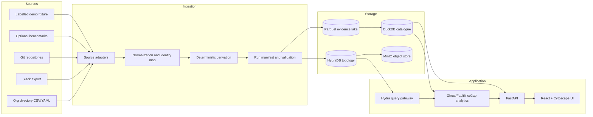

# X-Ray Evidence Platform Design

**Status:** Approved for implementation on 2026-08-14

**Authority:** This design corrects and narrows `xray-build-spec.md` where the current HydraDB implementation or released benchmark data contradict it.

## 1. Product outcome

X-Ray is a local-first socio-technical evidence platform that compares how work is technically coupled with how people coordinate. It produces three explainable findings:

1. **Ghost:** a person whose structural importance is materially higher than their formal rank.
2. **Faultline:** an observed technical dependency whose owners have weak or absent coordination evidence.
3. **Gap:** a record lineage that is structurally incomplete under an explicit source-system contract.

The product must never present an inference as an observed fact. Every finding exposes its source records, extraction method, confidence, query, analysis status, and limitations.

## 2. Corrected scope

The first production slice is a complete, runnable vertical product with:

- a pinned self-hosted HydraDB graph engine;
- a deterministic labelled demo fixture covering all three lenses;
- adapters for an organization directory, Slack exports, and Git repositories;
- optional HERB and EnterpriseRAG-Bench adapters that only derive relationships their released data supports;
- ingestion, provenance, graph loading, analytics, REST APIs, and a three-panel UI;
- repeatable evaluation and throughput harnesses;
- Docker Compose plus Windows and POSIX setup commands;
- a polished implementation blueprint exported to PDF.

The first slice does not include Gmail, Microsoft 365, Jira Cloud OAuth, enterprise SSO, Kubernetes, GNN training, or automatic employee intervention. Those are later integrations over stable interfaces.

## 3. Evidence classes

Every node, edge, and finding has one of three evidence classes:

| Class | Meaning | UI treatment |
|---|---|---|
| `observed` | Directly represented by a source record, such as an explicit mention, Git import, changed file, author, or parent ID | Solid edge and “Observed” badge |
| `inferred` | Deterministically derived from observed records, such as ownership from authorship density or module coupling from co-change | Dashed edge, confidence, and derivation explanation |
| `demo_ground_truth` | Intentionally generated and labelled to test the full product when public benchmarks lack required topology | Distinct “Demo fixture” badge; never mixed into benchmark results |

The copy “proof of deletion” is prohibited. A Gap means only that the ingested corpus is incomplete relative to an explicit reference, sequence, or transition contract.

## 4. Primary-source corrections

### 4.1 HydraDB

Use HydraDB `v0.1.1`, commit `02a40025d2d57e97ab2754c8256219cdbfeab379`, with the immutable multi-architecture image:

```text
ghcr.io/hydra-db/hydradb@sha256:db78309a233be54662db29744047e985a39b51c45a270d1a1f47c31a62cdb709
```

The application observes these engine rules:

- ordinary Cypher matches use non-negative integer `id` properties;
- each `Person`, `Artifact`, `Module`, and `Phantom` also has a unique indexed string `path_key` for `algo.MSpaths` selectors;
- `sourceValues` and `targetValues` are safely generated inline lists of escaped string literals at this pinned release;
- `pairwise: true` is an unordered cross-set mode, not positional pairing;
- procedure rows are returned and collected in the client;
- all traversals are bounded and include an explicit `resultLimit`;
- `relDirection` uses `incoming`, `outgoing`, or `both`;
- batched node writes use `UNWIND $rows AS row MERGE ... SET` through Bolt;
- each request contains one statement and runs in auto-commit mode;
- `RUST_MIN_STACK=33554432` is mandatory.

### 4.2 Public datasets

HERB is optional, downloaded as raw product JSON, and never redistributed. It is CC BY-NC 4.0 and its released structure supports a mention/co-participation graph, not a reply graph: all released Slack `ThreadReplies` arrays are empty. Its PR records contain no changed files, commits, or module dependencies. Therefore HERB may support Ghost and retrieval evaluation, but it cannot be the factual source for Faultline or Gap.

EnterpriseRAG-Bench is MIT licensed and may be used in explicit subsets. Its rich source files can support thread co-participation and document retrieval evaluation, but its GitHub records are prose rather than repository code and do not establish technical dependencies.

Faultline requires a real Git repository or the labelled fixture. Gap requires explicit parent IDs, declared sequence positions, or an event transition contract; it is marked `unsupported` for datasets that lack them.

## 5. Architecture



HydraDB is the topology and bounded traversal engine. Parquet is the immutable normalized evidence layer. DuckDB supplies reproducible local joins, manifests, and analytics metadata without putting raw message bodies in the graph. The API is the sole browser-facing service.

## 6. Repository boundaries

```text
hydra/
  apps/
    api/                 FastAPI transport and dependency wiring
    web/                 React single-page application
  packages/
    xray_core/           Domain models, evidence rules, scores, and ports
    xray_ingest/         Source adapters, identity resolution, normalization
    xray_hydra/          Cypher builders, Bolt client, graph loader
    xray_analytics/      Ghost, Faultline, Gap, and evaluation algorithms
    xray_runtime/        Validated, manifest-backed Hydra/Compose lifecycles
  data/
    fixtures/            Versioned labelled synthetic fixture only
    schemas/             JSON Schemas for source and normalized records
  infra/                 Compose, health checks, MinIO initialization
  scripts/               Setup, download, ingest, benchmark, and PDF commands
  tests/                 Contract, integration, end-to-end, and golden tests
  docs/                  Design, plans, operations, evaluation, and report source
```

Each Python package depends on `xray_core` abstractions rather than on FastAPI. `xray_hydra` contains all engine-specific behavior. Analytics consume a graph-query port and evidence repository port, so their scoring can be unit-tested without a running database.

## 7. Canonical model

### 7.1 Graph nodes

All graph nodes have `id: int`, `path_key: string`, `evidence_class: string`, and `confidence: int` from 0 to 100.

- `Person`: `handle`, `display_name`, `role_rank`, `team_id`, `is_manager`.
- `Team`: `name`, `parent_team_id`.
- `Artifact`: `ext_ref`, `kind`, `created_epoch`, `source_type`, `thread_seq`.
- `Module`: `name`, `repo`, `language`, `criticality`.
- `Phantom`: `expected_kind`, `inferred_epoch`, `reason`, `contract_ref`.

Raw text, email addresses, OAuth tokens, and large source payloads stay in the evidence lake and are referenced by `ext_ref`.

### 7.2 Graph relationships

- `REPORTS_TO`: observed directory hierarchy.
- `AUTHORED`: observed authorship.
- `MENTIONS`: observed explicit mention.
- `COMMUNICATES`: derived weighted person-to-person interaction.
- `ABOUT`: observed or inferred artifact-to-module association.
- `OWNS`: derived ownership with confidence.
- `DEPENDS_ON`: observed imports/manifests/runtime calls or explicit reviewed dependency maps.
- `PRECEDED_BY`: later artifact to earlier artifact or phantom in an explicit record lineage.

`DEPENDS_ON` never contains Git co-change. Its `dependency_kind` property is one of `import`, `manifest`, `runtime_call`, or `explicit_reference`. Co-change remains a separately stored `inferred_coupling` candidate and appears only in an explicitly enabled “Coupling” UI filter; it never satisfies an observed dependency claim.

### 7.3 Evidence records

The Parquet evidence layer stores:

```text
EvidenceRecord(
  evidence_id, run_id, source_type, source_uri, source_record_id,
  observed_epoch, subject_key, predicate, object_key,
  evidence_class, confidence, extraction_method, content_sha256,
  redacted_excerpt, metadata_json
)
```

The ingestion manifest records adapter version, source fingerprint, start and end time, row counts, rejection counts, schema version, and output checksums. Re-running the same manifest is idempotent.

## 8. Ingestion design

1. **Discover:** enumerate source files or repository commits and calculate stable fingerprints.
2. **Parse:** adapters emit typed source events without resolving cross-source identities.
3. **Normalize:** the identity map converts source identifiers into canonical integer IDs. Exact directory keys win; aliases are explicit mappings; fuzzy matches are suggestions requiring approval and never enter HydraDB automatically.
4. **Derive:** create communication aggregates, module ownership, dependency/coupling edges, and eligible phantom records.
5. **Validate:** reject edges with missing endpoints, invalid confidence, negative IDs, unknown evidence class, or unsupported Gap contracts.
6. **Stage:** write immutable NDJSON/Parquet batches before database I/O.
7. **Load:** load all nodes, then relationships, through idempotent bounded `UNWIND` batches.
8. **Verify:** run count checks and a write/read/path smoke query before marking the run complete.

A failed run is resumable from its last verified batch. It never reports partial ingestion as complete.

## 9. Analysis definitions

### 9.1 Ghost

1. Select a deterministic stratified sample of people using a recorded random seed.
2. Run bounded `algo.MSpaths` calls over `COMMUNICATES`, using `path_key`, `relDirection: 'both'`, `maxLen: 4`, and explicit result limits.
3. Count intermediate nodes client-side and normalize by successfully evaluated source-target pairs.
4. Repeat across at least five seeds and report top-k Jaccard stability.
5. Compare sampled path centrality with weighted degree.
6. Convert both structural centrality and formal rank to percentiles; `rank_gap = structural_percentile - formal_percentile`.
7. For the highest-ranked candidates, run client-side bounded BFS after removing the candidate and report the change in reachable sampled pairs. This removal result is labelled client-side analysis, not a HydraDB exclusion query.

The result status is `complete`, `partial`, or `unsupported`. Result truncation, unresolved selectors, or missing samples make it `partial`, not a zero score. Execution failures are non-2xx RFC 9457 API problems and never masquerade as a fourth successful payload state.

### 9.2 Faultline

1. Enumerate `DEPENDS_ON` edges and retain dependency kind and provenance.
2. Resolve owners above a configurable confidence threshold.
3. Resolve each owner selector against the active snapshot, build the union of owner `path_key` values, call `MSpaths` with the hard-coded allow-list `relTypes: ['COMMUNICATES']`, and filter returned endpoint pairs against the requested owner-pair set. Parallel arrays are never treated as zipped pairs; artifact-mediated paths cannot count as coordination.
4. Classify coordination as `direct`, `near` (2 hops), `weak` (3–4 hops), `none_within_bound`, or `unknown`.
5. Calculate severity from dependency strength percentile, coordination class, ownership confidence, criticality, and evidence-class weight. The formula and components are shown in the finding.

“None within four hops” is not rendered as “never communicated.” If a traversal was truncated or an identity was unresolved, the pair is `unknown` and cannot be ranked as a faultline.

### 9.3 Gap

Eligible rules are:

- an explicit parent/reference ID points to a record absent from the completed source export;
- a source declares contiguous sequence positions and a position is absent;
- a configured state-machine transition requires an audit event that is absent from a completed event log.

The normalized lineage points backward in time: later `Artifact` → `PRECEDED_BY` → `Phantom` or earlier `Artifact`. `algo.SPpaths` therefore starts at the later artifact and traverses `outgoing` toward the earlier artifact. Both endpoints must resolve to their exact expected ID/canonical identity in the active snapshot before traversal. For unweighted lineage, choose deterministically by `pathWeight`, hop count, then node IDs; `pathCost` may be zero for unequal-length paths in the pinned release. The finding includes the exact contract, the neighbouring records, and alternative explanations such as export filtering.

## 10. API and error semantics

The API exposes versioned endpoints:

- `GET /api/v1/health`
- `POST /api/v1/session`
- `DELETE /api/v1/session`
- `GET /api/v1/runs`
- `POST /api/v1/runs`
- `GET /api/v1/snapshots/current`
- `GET /api/v1/snapshots/{snapshot_id}/ghosts`
- `GET /api/v1/snapshots/{snapshot_id}/faultlines`
- `POST /api/v1/snapshots/{snapshot_id}/gap-paths`
- `GET /api/v1/snapshots/{snapshot_id}/findings/{finding_id}/evidence`
- `GET /api/v1/evaluation/latest`

Every lens payload includes `analysis_status` and `status_explanation`; every query trace includes `generated_at`, snapshot/run ID, Cypher, redacted parameters, result limit, execution status, truncation, latency, Hydra commit, and limitations. Finding responses contain an evidence summary with query traces, confidence, limitations, provenance count, and source types. Full provenance is returned only by the separately authorized evidence endpoint. Errors use RFC 9457 problem details with a stable code, correlation ID, and retryability flag.

HydraDB unavailability returns `503`; malformed source data returns `422`; a supported analysis with no qualifying result returns `200` with an empty list; an analysis unsupported by the selected dataset returns `200` with `analysis_status: unsupported` and an explanation.

Health and setup-token exchange are public on the localhost profile. All other endpoints require an opaque HttpOnly SameSite-Strict session; full provenance additionally requires `evidence:read`. Every allowed or denied full-evidence access is durably audited before its response, and an unavailable audit sink fails closed. The browser never stores bearer tokens. Run creation accepts configured source-profile IDs rather than arbitrary server paths.

## 11. User experience

The single-page UI has a persistent data-run selector, health indicator, evidence-class legend, theme trigger, and three lens tabs. The user-approved 806×589 terminal-theme reference dated 2026-08-14 is the visual source of truth: a deep Nightfox desktop shell, muted blue-grey type, teal active selection, large rounded bordered surfaces, compact window-status rail, and a keyboard-first searchable theme dialog. Product labels and graph content remain X-Ray-specific; unrelated reference branding is not copied.

- **The Org:** one communication graph with an Official/Actual switch. Official size uses formal-rank percentile; Actual size uses stable sampled centrality. A side panel explains rank gap, stability, degree comparison, and removal impact.
- **Faultlines:** module graph plus sortable table. Only complete, evidence-backed findings pulse red. Unknown pairs render neutral grey. Filters separate observed dependencies from inferred coupling.
- **Gaps:** select two records and render backward evidence lineage. Phantom nodes use a broken-outline treatment and show reason, expected type/time, contract, and alternative explanations.

Nightfox is the deterministic default. Five additional locally bundled CSS-token themes—Catppuccin Mocha, Dracula, Monokai, Tokyo Night, and Nord—may change presentation tokens but never semantic meaning. The theme dialog uses native modal behavior, search, listbox arrow navigation, Enter, Escape, focus containment/restoration, and `Ctrl+K`/`Cmd+K`; the validated choice persists locally and never enters evidence URLs or API requests. JetBrains Mono is used for terminal chrome, commands, IDs, and query evidence; Inter remains the reading face for explanations and dense tables. Every theme passes WCAG AA, reduced motion, and graph/table semantic parity.

Every panel has a collapsible “How HydraDB answered this” section containing formatted Cypher, bounded traversal settings, returned-row count, truncation status, and latency. Evidence drawers fetch authorized full provenance on demand; a 403 preserves the summary and explains the missing scope without leaking excerpts.

The interface is keyboard-operable, responsive down to 360 px, respects reduced-motion preferences, never relies on colour alone, and provides a tabular alternative for every graph.

## 12. Privacy and security

- Local development is plaintext only inside the Compose network; browser traffic goes through the API.
- Secrets are mounted files or environment variables excluded from version control.
- Default source excerpts are redacted and limited; raw content is never written to HydraDB.
- Email addresses and external identifiers are HMAC-pseudonymized with an organization-specific key before any non-synthetic run.
- No real source is processed before metadata-only policy, pseudonymization, log redaction, a writable self-tested audit sink, localhost binding, tenant isolation, and session authentication pass.
- Retention rebuilds a verified green graph from retained facts, atomically swaps the active-snapshot pointer, and makes the former graph unreachable through the API before deleting eligible local evidence. HydraDB v0.1.1 has no assumed public graph-delete API; residual object prefixes are disclosed and require a separately confirmed, exact-prefix operator procedure after legal-hold and backup checks.
- Findings are decision support, not employee-performance scores. The UI includes this limitation and exports an audit trail.
- Production deployment requires TLS, authentication, role-based access, source consent, retention policy, and a documented data-protection impact assessment.

## 13. Testing and evaluation

The build follows test-driven development at each boundary:

- unit tests for normalization, scoring, Cypher escaping, pair filtering, and status semantics;
- property tests for non-negative stable IDs and valid bounded queries;
- golden tests for source adapters and fixture outputs;
- contract tests against the pinned HydraDB image;
- integration tests for idempotent/resumable loading and all three path procedures;
- API schema and RFC 9457 error tests;
- component accessibility tests and Playwright end-to-end flows;
- throughput tests across `UNWIND` batch sizes 500, 1,000, 2,000, and 5,000;
- Ghost stability and degree-baseline comparisons;
- labelled-fixture precision/recall for Faultline and Gap;
- benchmark document recall and correct-abstention reporting under the benchmark’s exact protocol.

No fixed throughput or HERB score is promised before measurement. Evaluation code is committed first and runs only from a clean source tree. Runtime and document-tool images use separate immutable locks. Each complete evaluation manifest records the exact code/tree, Git status, language lockfiles, runtime-image lock/effective-runtime images, dataset manifest, configuration, and result-artifact hashes together with hardware and commands. Raw trials remain separate from a later reviewed-results commit. The committed release binding links the final PDF to the evaluated commit and accepts only a documented docs/release-only diff; an application, dataset, scoring, dependency-lock, Compose, or runtime-image change forces reevaluation. A detached signed/CI attestation created after the final commit binds that final SHA to the committed binding and PDF hashes, avoiding a self-referential tracked file.

## 14. Operations

Docker Compose is staged. The `core` profile contains digest-pinned MinIO, bucket initializer, HydraDB graph-node, and graph-indexer. After the applications exist, the `app` profile adds API and web, and `demo` adds a one-shot seed service. Graph IDs, object prefixes, projects, ports, credentials, and runtime directories are parameterized through a validated `GraphRuntimeSpec`; a manifest-backed manager starts, verifies, routes, rolls back, and stops exact handles. This permits isolated benchmark trials and concurrent old/green retention graphs without aliasing or string-built teardown. Services are health-gated. HydraDB readiness is followed by write/read/path verification, an indexer-cycle check, process restart, and a second selector/path read before ingestion begins.

`setup.sh` and `setup.ps1` start the labelled fixture and wait for a usable UI. Optional benchmark download and full ingestion are separate explicit commands; “UI live under 60 seconds” does not imply a full external corpus has loaded.

The application uses Apache-2.0. HydraDB remains an external AGPL-3.0 service; the source-built MinIO development service is also AGPL-3.0. Both are attributed with pinned sources and image identities, and the boto3 initializer/document toolchain are inventoried as well. Dataset licenses and restrictions are documented per adapter. Optional raw datasets, evidence stores, credentials, and result caches are excluded from source control and image layers.

## 15. Delivery sequence

1. **Foundation:** repository, domain schemas, fixture, pinned Compose, health and Cypher contract.
2. **Vertical slice:** idempotent loader, all three analyses, API, and complete three-panel UI on labelled fixture.
3. **Real sources:** org directory, Slack export, Git dependency/co-change extraction, HERB Ghost-only adapter, optional EnterpriseRAG subset.
4. **Evaluation:** throughput, correctness, stability, baselines, and transparent result report.
5. **Hardening:** privacy controls, retention, accessibility, CI, clean-clone verification, README, and PDF blueprint.

## 16. Definition of done

- A clean clone starts the labelled product with one documented command on Windows and POSIX hosts with Docker.
- The pinned HydraDB image passes readiness plus a write/read/path round trip.
- All three lenses produce labelled-fixture findings with visible provenance, query, confidence, and limitations.
- Real adapters never claim unsupported relationships.
- Re-ingestion is idempotent and interrupted ingestion resumes safely.
- Unit, integration, API, frontend, accessibility, and end-to-end suites pass.
- Measured throughput and evaluation results are reproducible and include negative results.
- The README distinguishes the open-source engine from the hosted Hydra product and records all licenses.
- The implementation blueprint passes automated text/font/raster checks, has a reviewer-attested manifest bound to the PDF and every visually inspected page by SHA-256, and can be opened safely in Adobe Acrobat.
